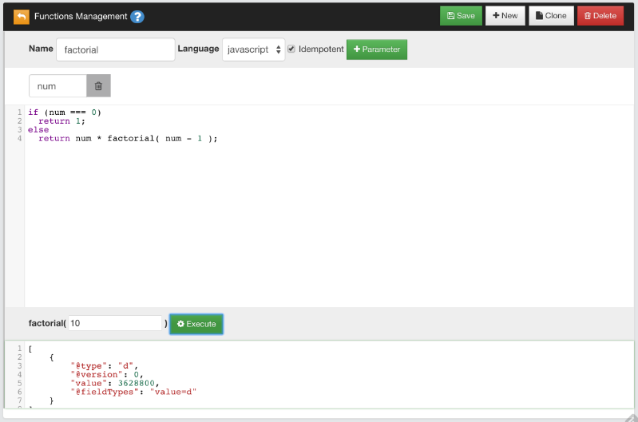

---
search:
   keywords: ['functions', 'create', 'creation', 'javascript']
---

# OrientDB Function Creation

OrientDB provides a number of functions by default.  In the event that these are not sufficient for your needs, you can create custom functions using OrientDB SQL or JavaScript.  You can then execute them as SQL, HTTP or Java.


## Creating Functions

When you create a new function on your database, OrientDB saves it using the `OFunction` class.  You can query records of this class as you would any other in the database.  The class has the following properties:

| Property | Description |
|---|---|
| **`name`** | Defines the name of the function. |
| **`code`** | Defines the code the function executes. |
| **`parameters`** | Defines an optional `EMBEDDEDLIST` of strings, containing the parameter names, if any. |
| **`idempotent`** | Defines whether the function is idempotent, that is if it changes the database.  Read-only functions are idempotent.  This is needed to avoid calling non-idempotent functions using the HTTP GET method. |

>Given that OrientDB uses one record per function, the MVCC mechanism is used to protect it against concurrent record updates.

There are two ways to create a function on the database: [Studio](#using-orientdb-studio) and [SQL](#using-orientdb-sql)


### Using OrientDB Studio

Whether you are new to OrientDB and unfamiliar with the command syntax or you simply prefer graphical- to text-based interfaces, OrientDB ships with a convenient web interface for accessing and manipulating databases.  Using [Studio](Studio-Home-page.md), you can create and manage custom Functions.

When you log into a database in Studio, there are a series of links running along the top of the page.  The **Functions** tab takes you to a page where you can create, edit and otherwise manage custom functions in the database.

#### Example

Imagine a situation where you need to caculate factorials on a regular basis.  While you could pull this information into your application, it would save time and network traffic if you could have OrientDB process the math and return the results.  OrientDB Functions support recursion, so this is a fairly straightforward process.

To manage this, you would navigate to the Functions tab and create a new function, naming it `factorial` or whatever name you find most approriate.  This function is written in JavaScript and takes one argument, called `num`.  Then, provide the following code:

```
if (num === 0)
	return 1;
else
	return num * factorial(num - 1);
```

When this is done, click Save to update the database with the new function.  As you can see, OrientDB Functions support recursion.  When `factorial()` is called, it calls itself in calculating the results.



Once you've saved a function, it's accessible to the database.  You can also test functions below the text block by providing them with arguments and then clicking the Execute buttom.  OrientDB then displays the return value, which here is 3648800.0.

Alternatively, you can test it from the Console:

<pre>
orientdb> <code class="lang-sql userinput">SELECT factorial(10)</code>
3628800
</pre>


### Using OrientDB SQL 

In the event that you prefer working from shell environments, OrientDB also provides the [`CREATE FUNCTION`](SQL-Create-Function.md) SQL command.  For instance, take the above example creating a `factorial()` function.

<pre>
orientdb> <code class="lang-sql userinput">CREATE FUNCTION factorial "if (num === 0) return 1; 
          else return num * factorial(num - 1)" 
		  PARAMETERS [num]</code>
</pre>

#### Managing Functions

Using API's like [PyOrient](PyOrient.md) or [OrientJS](OrientJS.md) in combination with OrientDB SQL commands, you can manage and update Functions using basic scripts to synchronize a repository with the database. 

For instance, imagine you have a Git repository that contains a series of JavaScript files as well as a manifest file written in JSON, containing the metadata OrientDB needs to configure functions on the database.  Using a simple Python function in a script, you could automatically synchronize all OrientDB Functions with your repository code.

```python
################## Update Functions ###################
def update_orientdb_functions(client, funcs):
	""" Recieves PyOrient client with opened database
	and a dictionary containing metadata for each
	function

	funcs = {
	   "func-name": {
	      "arguments": ["arg1", "arg2"],
		  "code": "/path/to/code.js"}
	}

	Connects to OrientDB Database and creates or updates
	functions with the given code."""

	# Loop over Functions Dict
	for name, data in funcs.items():


		# Read Code from File
		with open(data["code"], "r") as f:
			code = f.read()

		# Create Function when it does not Exist
		query_func = "SELECT FROM OFunction WHERE name = '%s" % name
		if len(client.command(query_func)) == 0:

			# Create Function Command
			osql = "CREATE FUNCTION %s '%s'" % (name, code)

			# Add Arguments 
			if "arguments" in data:
				osql += " PARAMETERS %s" % str(data["arguments"])

			# Run Command
			client.command(osql)
			
		# Update Function when Exists
		else:
		
			# Create Update Command
			osql = "UPDATE Ofunction SET code = '%s'" % code

			# Add Arguments
			if "arguments" in data:
				osql += ", parameters = '%s'" % str(data["arguments"])

			# Define Condition	
			osql += " WHERE name = '%s'" % name

			# Run Command
			client.command(oqsl)
```
