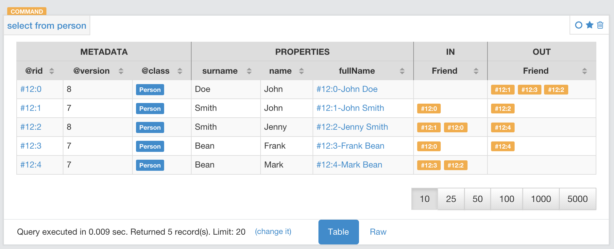
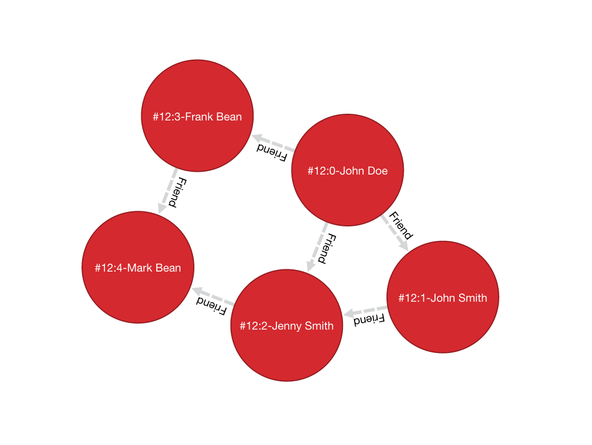

# SQL - MATCH

(since 2.2)

Match statements allows to query the db in a declarative way, using pattern matching.

# Syntax 

### Simplified
```
MATCH 
  {
    [class: <className>], 
    [as: <alias>], 
    [where: (<whereCondition>)]
  }
  .<functionName>(){
    [class: <className>], 
    [as: <alias>], 
    [where: (<whereCondition>)], 
    [while: (<whileCondition>)]
    [maxDepth: <number>]
  }*
RETURN <alias> [, <alias>]*
LIMIT <number>
```

- **className**: a valid target class name
- **alias**: alias for a node of the pattern
- **whereCondition**: filter condition (a normal WHERE contition supported in SQL) to match a node in the pattern
- **functionName**: a graph function representing a connection between two nodes (eg. ```out(), in(), outE(), inE()...```)
- **whileCondition**: a condition (a normal WHERE contition supported in SQL) that has to be met to allow the traversal of this path
- **maxDepth**: the maximum depth for this single path
- **return** ```<alias> [, <alias>]*```: specifies the elements in the pattern that have to be returned. 
Can be one or more aliases defined in the ```as``` block, ```$matches``` to indicate all the defined alias, 
```$paths``` to indicate full traversed paths

### BNF
```
	MatchStatement := ( <MATCH> MatchExpression ( <COMMA> MatchExpression )* <RETURN> Identifier ( <COMMA> Identifier )* ( Limit )? )
	
	MatchExpression	:=	( MatchFilter ( ( MatchPathItem | MultiMatchPathItem ) )* )
	
	MatchPathItem	:=	( MethodCall ( MatchFilter )? )
	
	MatchPathItemFirst	:=	( FunctionCall ( MatchFilter )? )
	
	MultiMatchPathItem	:=	( <DOT> <LPAREN> MatchPathItemFirst ( MatchPathItem )* <RPAREN> ( MatchFilter )? )
	
	MatchFilter	:=	( <LBRACE> ( MatchFilterItem ( <COMMA> MatchFilterItem )* )? <RBRACE> )
	
	MatchFilterItem	:=	( ( <CLASS> <COLON> Expression )  | ( <AS> <COLON> Identifier ) | ( <WHERE> <COLON> <LPAREN> ( WhereClause ) <RPAREN> ) | ( <WHILE> <COLON> <LPAREN> ( WhereClause ) <RPAREN> ) | ( <MAXDEPTH> <COLON> Integer ) )

```

### Examples

Sample dataset: People






**Get all people whose name is John**
```SQL
MATCH {class: Person, as: people, where: (name = 'John')} RETURN people
```
result:

| people |
|--------|
| #12:0  |
| #12:1  |

**Get all people whose name is John and whose surname is Smith**
```SQL
MATCH {class: Person, as: people, where: (name = 'John' and surname = 'Smith')} RETURN people
```

result:

| people |
|--------|
| #12:1  |


**Get all people whose name is John, together with their friends**
```SQL
  MATCH {
    class: Person, 
    as: person, 
    where: (name = 'John')
  }.both('Friend'){
    as: friend
  }
  RETURN person, friend
```

| people | friend |
|--------|--------|
| #12:0  | #12:1  |
| #12:0  | #12:2  |
| #12:0  | #12:3  |
| #12:1  | #12:0  |
| #12:1  | #12:2  |

expanding attributes

```SQL
SELECT 
person.name as name, person.surname as surname, 
friend.name as friendName, friend.surname as friendSurname 
FROM (
  MATCH {
    class: Person, 
    as: person, 
    where: (name = 'John')
  }.both('Friend'){
    as: friend
  }
  RETURN person, friend
)
```

| name   | surname  | friendName | friendSurname |
|--------|----------|------------|---------------|
| John   | Doe      | John       | Smith         |
| John   | Doe      | Jenny      | Smith         |
| John   | Doe      | Frank      | Bean          |
| John   | Smith    | John       | Doe           |
| John   | Smith    | Jenny      | Smith         |

**Friends of friends**

```SQL
  MATCH {
    class: Person, 
    as: person, 
    where: (name = 'John' and surname = 'Doe')
  }.both('Friend')
   .both('Friend'){
    as: friendOfFriend
  }
  RETURN person, friendOfFriend
```
| people | friendOfFriend |
|--------|----------------|
| #12:0  | #12:0          |
| #12:0  | #12:1          |
| #12:0  | #12:2          |
| #12:0  | #12:3          |
| #12:0  | #12:4          |

exclude myself

```SQL
  MATCH {
    class: Person, 
    as: person, 
    where: (name = 'John' and surname = 'Doe')
  }.both('Friend')
   .both('Friend'){
    as: friendOfFriend,
    where: ($matched.person != $currentMatch)
  }
  RETURN person, friendOfFriend
```

| people | friendOfFriend |
|--------|----------------|
| #12:0  | #12:1          |
| #12:0  | #12:2          |
| #12:0  | #12:3          |
| #12:0  | #12:4          |

**Friends of friends, until level 6**
```SQL
  MATCH {
    class: Person, 
    as: person, 
    where: (name = 'John' and surname = 'Doe')
  }.both('Friend'){
    as: friend,
    where: ($matched.person != $currentMatch)
    while: ($depth < 6)
  }
  RETURN person, friend
```
| people | friend         |
|--------|----------------|
| #12:0  | #12:0          |
| #12:0  | #12:1          |
| #12:0  | #12:2          |
| #12:0  | #12:3          |
| #12:0  | #12:4          |

**nested paths: friends until depth 6, since a date (suppose this date is on the "Friend" edge)**

```SQL
  MATCH {
    class: Person, 
    as: person, 
    where: (name = 'John')
  }.(
      bothE('Friend'){
        where: (date < ?)
      }.bothV()
  ){
      as: friend,
      while: ($depth < 6)
  }
  RETURN person, friend
```

in this case, the condition ```($depth < 6)``` refers to six times traversing the block 
```sql
(
      bothE('Friend'){
        where: (date < ?)
      }.bothV()
  )
```

Try it with regular edges ;-)

**multiple paths: friends of my friends who are also my friends**

```SQL
  MATCH 
  {
    class: Person, 
    as: person, 
    where: (name = 'John' and surname = 'Doe')
  }.both('Friend')
   .both('Friend'){
    as: friend
  },
  
  { as: person }.both('Friend'){ as: friend }
  
  RETURN person, friend
```

| people | friend         |
|--------|----------------|
| #12:0  | #12:1          |
| #12:0  | #12:2          |


**common friends**

Find common friends of John and Jenny

```SQL
  MATCH 
  {
    class: Person, 
    where: (name = 'John' and surname = 'Doe')
  }.both('Friend'){
    as: friend
  }.both('Friend'){
    class: Person, 
    where: (name = 'Jenny')
  }
  RETURN friend
```

| friend |
|--------|
| #12:1  |


The same, with two match expressions:

```SQL
  MATCH 
  {
    class: Person, 
    where: (name = 'John' and surname = 'Doe')
  }.both('Friend'){
    as: friend
  }
  ,
  {
    class: Person, 
    where: (name = 'Jenny')
  }.both('Friend'){
    as: friend
  }
  RETURN friend
```

**Real use case: manager in an incomplete hierarchy**

Suppose you have a hierarchy of departments as follows:

```
    ______ [manager] department _______
    _____ (employees in department)____
    ___________________________________
    ___________________________________
    ____________[a]0___________________
    _____________(p1)__________________
    _____________/___\_________________
    ____________/_____\________________
    ___________/_______\_______________
    _______[b]1_________2[d]___________
    ______(p2, p3)_____(p4, p5)________
    _________/_\_________/_\___________
    ________3___4_______5___6__________
    ______(p6)_(p7)___(p8)__(p9)_______
    ______/__\_________________________
    __[c]7_____8_______________________
    __(p10)___(p11)____________________
    ___/_______________________________
    __9________________________________
    (p12, p13)_________________________

short description:
Department 0 is the company itself, "a" is the CEO
p10 works at department 7, his manager is "c"
p12 works at department 9, this department has no direct manager, so p12's manager is c (the upper manager)
```

To find the manager of a person:

```sql
select expand(manager) from (
  match {
      class:Employee, 
      where: (name = ?)
    }.out('WorksAt')
     .out('ParentDepartment'){
        while: (out('Manager').size() == 0),
        where: (out('Manager').size() > 0)
    }.out('Manager'){
    	as: manager
    }
  return manager
)

```


### Deep traversal (while condition)

A match path item will act in different ways if you have a ```while``` condition or not.

Suppose you have the following graph:

``` 
[name='a'] -FriendOf-> [name='b'] -FriendOf-> [name='c']
```

The following

```sql
MATCH {
    class: Person,
    where: (name = 'a')
  }.out("FriendOf"){
    as: friend
  }
RETURN friend  
```

| friend |
|--------|
| b      |


will return ```b``` only.
This means that the path item ```out("FriendOf")``` will be traversed exactly once and only the result of that 
traversal will be returned

If you add a ```while``` condition:
```sql
MATCH {
    class: Person,
    where: (name = 'a')
  }.out("FriendOf"){
    as: friend,
    while: ($depth <= 1)
  }
RETURN friend  
```

| friend |
|--------|
| a      |
| b      |

the query will return both ```a``` and ```b```.

If you have a ```while``` condition on a match path item, this item will be evaluated **zero to N times**,
that means that **also the starting node** (```a``` in this case) **will be returned** as the result of zero traversal.

To exclude the starting point, you have to add a ```where``` condition, like following:
```sql
MATCH {
    class: Person,
    where: (name = 'a')
  }.out("FriendOf"){
    as: friend,
    while: ($depth <= 1)
    where: ($depth > 0)
  }
RETURN friend  
```

The general rule is the following:
- ```while``` condition defines if next traversal has to be executed (it is evaluated also at level zero, on the origin node)
- ```where``` condition defines if the current element (the origin node at the zero iteration, the right node on iteration > 0) 
has to be returned as a result of the traversal

An example to understand: suppose you have a genealogical tree and you are interested in having a person, his grandfather,
the gradnfather of this grandfather and so on; so saying that the person is at level zero, his parents are at level 1, 
his grandparents are at level 2 and so on, you are interested in all ancestors at even level (level % 2 == 0)

This query does the trick

```sql
MATCH {
    class: Person,
    where: (name = 'a')
  }.out("Parent"){
    as: ancestor,
    while: (true)
    where: ($depth % 2 = 0)
  }
RETURN ancestor  
```


### Context Variables

- ```$matched```: the current matched record, defined as a record whose attributes are all the aliases (```as```) 
explicitly defined in the statement. This can be used in ```where``` and ```while``` conditions to refer current partial match, 
or as a ```RETURN``` value
- ```$currentMatch``` the current (right) node during match
- ```$depth``` the traversal depth on a single path item, where a ```while``` condition is defined
