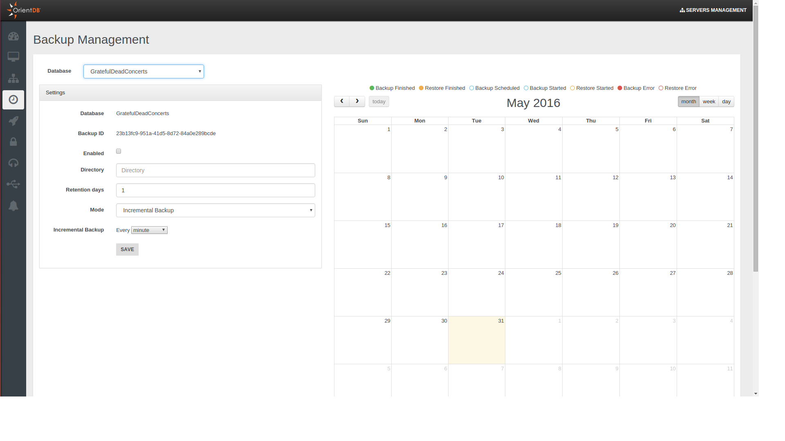
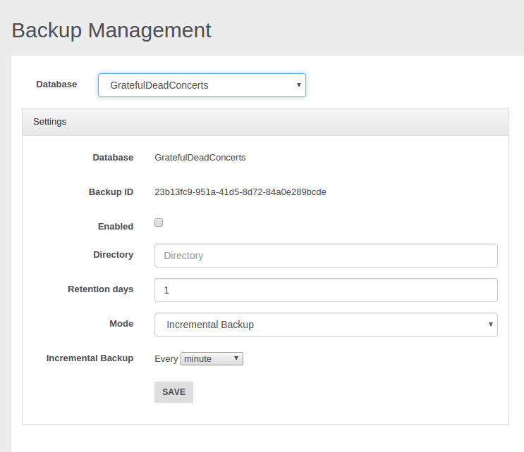
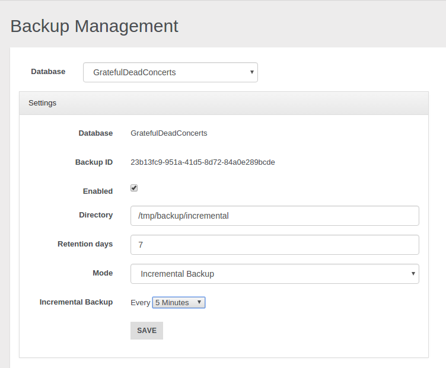

#Backup Management

Studio 2.2 Enterprise Edition includes a new **Backup Manager** that allow you to schedule and perform your backups and easily execute and manage restores you may need.
You can enjoy this functionality by reaching the panel in the Server Management area, this is what you will find:



How you can see the panel is divided into two sections, on the left side you can schedule your backups, on the right side on the calendar you can check:
- the executed tasks (backup or restore)
- the scheduled backups
- eventual error raised during the execuion of a task

Now let's see how you can schedule your backups.

## Backup scheduling

On the left you can find all the settings for your backup scheduling.



As first thing **choose the database** that you want backup. In the example above we have chosen the GratefulDeadConcerts
database.
Then you must specify the **output directory** where you want to save your backups and the **retention days** of your backups.
Now you must select the **backup mode** you want to use:
- **Full backup**
- **Incremental Backup**
- **Full + Incremental Backup**

These modes will be analysed further.

Once you have chosen the desired backup mode, you have to choose the **backup period** that indicates the time you want to
wait between each backup and the next one.
Eventually you must flag the **Enabled** checkbox and click on the **Save** button in order to start the scheduling of the 
backups according to your settings.

Below we will examine briefly the three different backup strategies.

###Full backup
Through this mode at every period striking a full backup will be performed in the path you specified in the settings.
If you want know more about the full backup you can refer to the [Full Backup](Backup-and-Restore.md) page.


With the settings shown above a full backup will be performed every 5 minutes. In our example, as the period is 5 minutes, after 5 minutes we will have the first backup, after 10 minutes the second one and so on.

```
/tmp/backup/full
          |
          |____________<directory-backup1>                         
          |                      |____________<full-backup-file1>    // execute at 00:00:00
          |
          |____________<directory-backup2>                         
          |                      |____________<full-backup-file2>    // execute at 00:00:00
          |
          |____________<directory-backup3>                        
          |                      |____________<full-backup-file3>    // execute at 00:00:00
          ...
```


###Incremental Backup
If you prefer to execute an incremental backup you can select this mode.
As declared in the [Incremental Backup](Incremental-Backup-And-Restore.md) page the incremental backup generates smaller backup files by storing only the delta between two versions of the database.
Let's suppose we want execute a backup every 5 minutes: then will be performed a first full backup which will be followed by a new incremental backup, containing  only the delta, every 5 minutes.



```
/tmp/backup/incremental
          |
          |____________<directory-backup1>                         
                                |____________<full-backup-file0>    // execute at 00:00:00
                                |____________<incr-backup-file1>    // execute at 00:00:00
                                |____________<incr-backup-file2>    // execute at 00:00:00
                                |____________<incr-backup-file3>    // execute at 00:00:00
                                |____________<incr-backup-file4>    // execute at 00:00:00
                                ...

```


###Full + Incremental Backup
This mode is follows an hybrid approach between the first two strategies, combining them according to your criteria. The first relevant thing you can notice it's you must specify two different backup-periods:
- Full Backup period: it specifies how much time wait between two sequential full backups.
- Incremental Backup period: it specifies how much time wait between two sequential incremental backups.


Let's analyse in which way the two modes are combined. Suppose we decided to execute the full backup every 5 minutes and the incremental backup every 1 minute as shown in the example above.
Thus we will obtain that every 5 minutes a new directory with a full backup will be added in the specified path, then in the following 4 minutes will be performed an incremental backup. As we set 1 minute for the incremental backup, we will have 4 incremental backups after the first full.
After 5 minutes a new full backup in another directory will be performed, and the following incremental will be executed according to the deltas relative to this second full backup and they will put in this second directory.
That's all, after another 5 minutes we will have a third directory with an initial full backup that will be followed by 4 
incremental backups, ans so on.

```
/tmp/backup/full-incremental
          |
          |____________<directory-backup1>                         
          |                      |____________<full-backup-file0>    // execute at 00:00:00
          |                      |____________<incr-backup-file1>    // execute at 00:00:00
          |                      |____________<incr-backup-file2>    // execute at 00:00:00
          |                      |____________<incr-backup-file3>    // execute at 00:00:00
          |                      |____________<incr-backup-file4>    // execute at 00:00:00
          |
          |____________<directory-backup2>                         
          |                      |____________<full-backup-file0>    // execute at 00:00:00
          |                      |____________<incr-backup-file1>    // execute at 00:00:00
          |                      |____________<incr-backup-file2>    // execute at 00:00:00
          |                      |____________<incr-backup-file3>    // execute at 00:00:00
          |                      |____________<incr-backup-file4>    // execute at 00:00:00
          |
          |____________<directory-backup3>                         // execute at 00:00:00
          |                      |____________<full-backup-file0>
          |                      ...
          ...
```

##Restore

In the calendar you can visualize and filter all the tasks (with the eventual related errors) through the voices above:
- Backup Finished
- Restore Finished
- Backup Scheduled
- Backup Started
- Restore Started
- Restore Started
- Backup Error
- Restore Error

Notice you can choose three different scopes: month, week and day.

Clicking on a backup you can examine additional info like execution timestamp, directory path, file name and file size.
Moreover you can remove the backup or carry out a restore starting from it.


Let's make a restore by clicking on the butto "Restore Backup". A new window will be opened.


As you can see you must select the database where you want restore the backup: notice you must specify a fresh database you just created manually or specify only the name of a new database, a new empty database will be automatically created for the restore procedure.
Below are reported all the files involved in the restore procedure: the number of file used to restore your database depends on the **backup mode** you choose for the selected backup.

If the backup belongs to a Full Backup schedule, there is only a file involved.


If the backup belongs to an Incremental Backup schedule, doesn't matter which file is selected, al the files in the directory will be evaluated during the restore.


If you chose a backup belonging to a Full + Incremental backup schedule, then will be evaluated all the files contained in the directory which contains the backup file you selected form the calendar.


