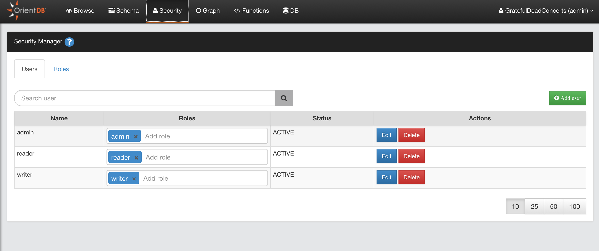

#Security

Studio 2.0 includes the new Security Management where you can manage Users and Roles in a graphical way.
For detailed information about Security in OrientDB, visit [here](Security.md)

## Users

Here you can manage the database users:

* Search Users
* Add Users
* Delete Users
* Edit User: roles can be edited in-line, for name, status and password click the **Edit** button

### Add Users

To add a new User, click the **Add User** button, complete the information for the new user
(name, password, status, roles) and then save to add the new user to the database. 

## Roles

Here you can manage the database roles:

* Search Role
* Add Role
* Delete Role
* Edit Role

### Add Role

To add a new User, click the **Add Role** button, complete the information for the new role
(name, parent role, mode) and then save to add the new role to the database.

### Add Rule to a Role

To add a new security rule for the selected role, click the *Add Rule* button.
This will ask you the string of the resource that you want to secure. For a list of 
available resources, see [Resources](Database-Security.md#resources)

Then you can configure the CRUD permissions on the newly created resource.

