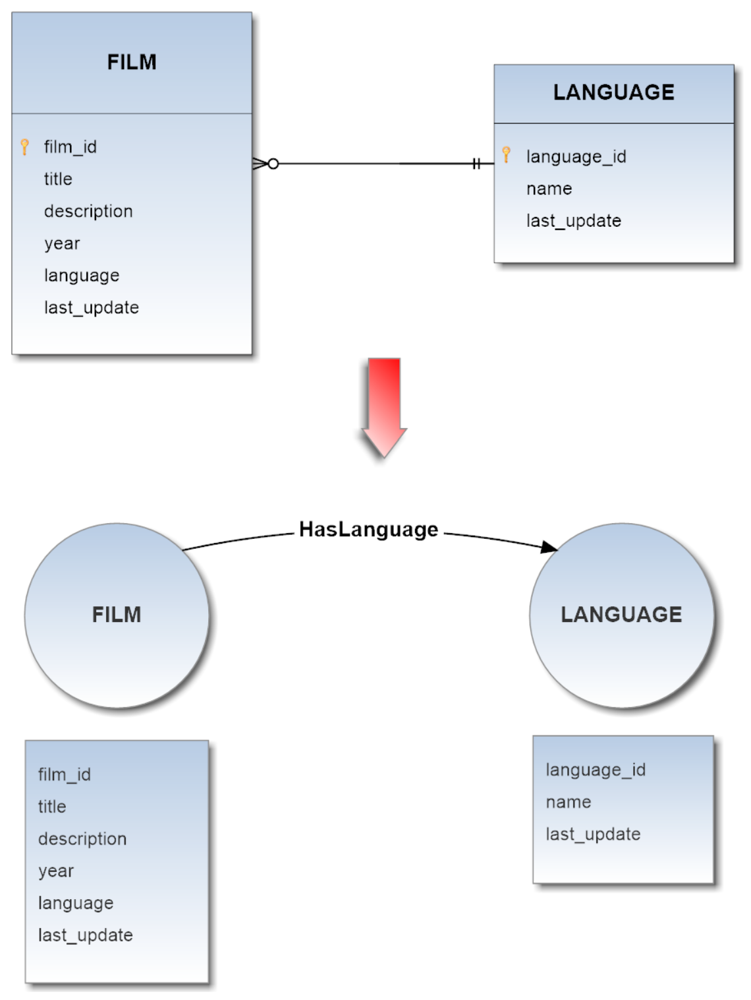
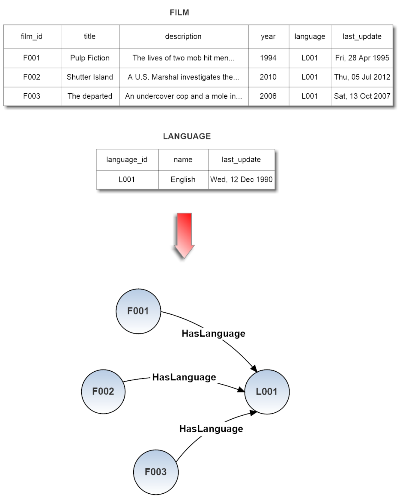
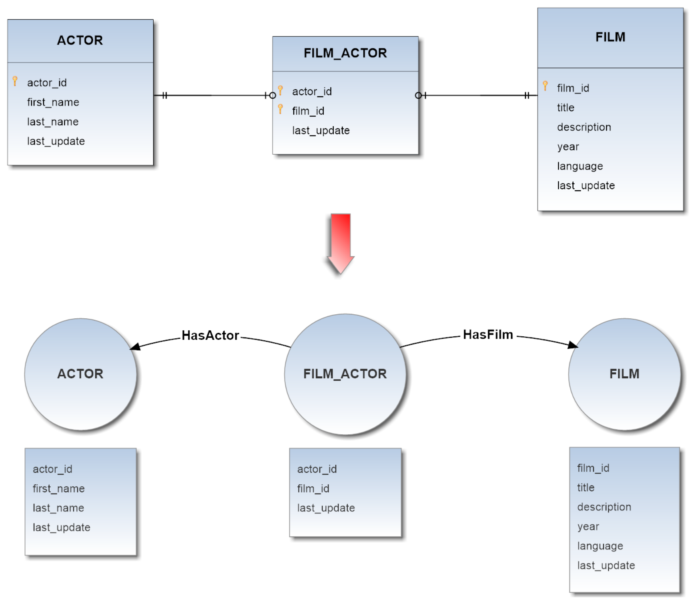
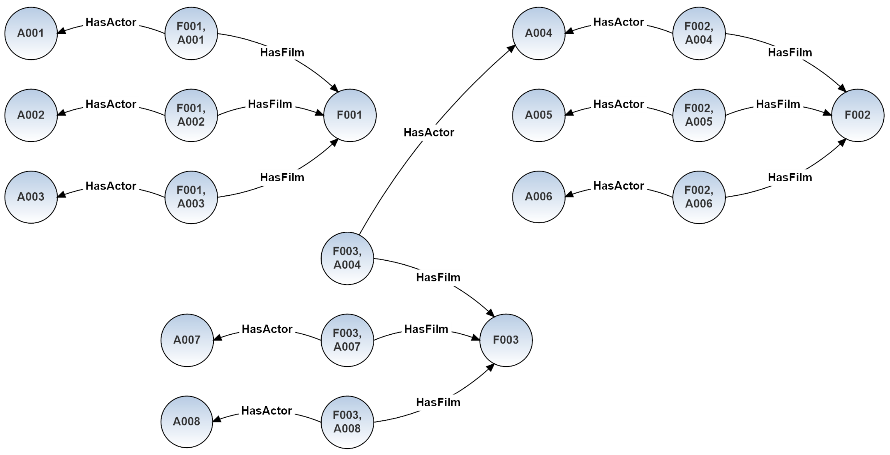
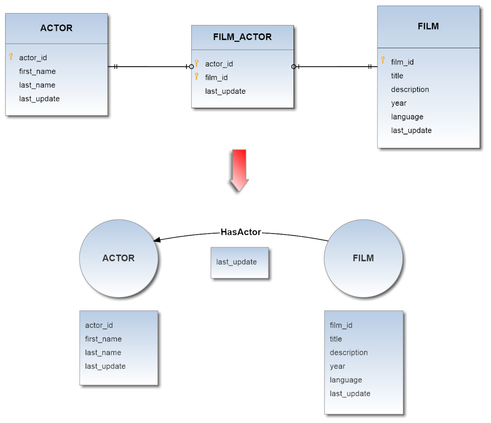
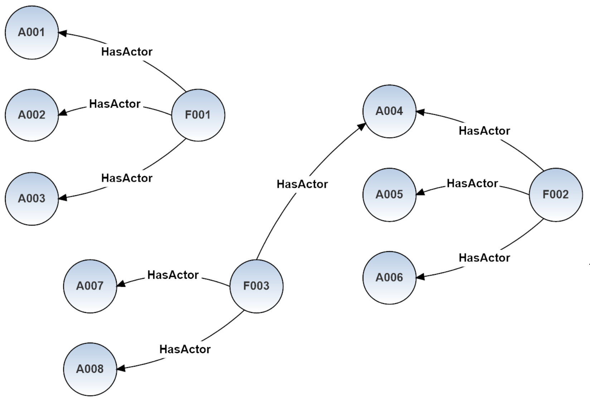

# Execution Strategies
Teleporter provides two different import strategies:
- **naive** strategy
- **naive-aggregate** strategy

Both strategies build a schema in OrientDB starting from the source DB schema: each table (known also as Entity) and each Relationship in the DB is inferred from these metadata, therefore if you didn't defined some constraints, such as foreign keys between the tables on which you usually perform join operations, you will lose this kind of info during the import process.
For example if foreign keys are missing, you will not have any edges in your final Graph Database.  
Once built the OrientDB schema, the real import process begins.

Now both strategies will be individually discussed below.

## Naive Strategy
This strategy follows a basic approach for the import. The source DB schema is directly translated in the OrientDB schema as follows:

1. Each Entity in the source DB is converted into a Vertex Type.
2. Each Relationship between two Entities in the source DB is converted into an Edge Type (remember, relationships in your DB schema are represented  by the foreign keys).

Thus all records of each table are imported according to this "schemas-mapping": each pair of records on which it's possible to perform a join operation, will correspond to a pair of vertices connected by an edge of a specific Edge Type.

####Example 1 - Without Join Table
Source DB schema translation in OrientDB schema:      

   

Correspondent records import:      

     

####Example 2 - With Aggregable Join Table
Source DB schema translation in OrientDB schema:      

     

Starting from the following tables    

       

we will obtain the following graph:     

     

## Naive-Aggregate Strategy
Unlike the first strategy, this one performs aggregation on the join tables of dimension equals to 2, that is to say those tables which map two tables together by referencing the primary keys of each data table through a foreing key. The join tables of dimension greater than 2 are ignored by the aggregation algorithm.
Thus each candidate join table is converted into an appropriate edge, and each field not involved in any relationship with other tables (hence not involved in any foreign key in the source DB schema) is aggregated in the properties of the new built edge.

Referring to the scenario of the last example is evident as even if the new DB doesn't reflect the original DB model, the aggregation leads to a great saving in terms of resources and avoids a substantial overhead. The OrientDB schema after the aggregation process comes out simpler, hence also the import result it is.    
     
####Example 3 - With Aggregable Join Table
Source DB schema translation in OrientDB schema:       

    

Through this strategy, starting from the same previous scenario      

   

this time we will obtain a less complex graph:      

