---
search:
   keywords: ['CLOUD', 'DASHBOARD']
---

## Projects

A project represent a single OrientDB deployment (Standalone or Cluster).

To start monitoring OrientDB server/cluster you need first an Enterprise Agent. 

* Download the enterprise agent [here](https://orientdb.com/orientdb-enterprise/).
* Install it in the $ORIENTDB_HOME/plugins directory.
* Generate an agent token [here](#agent).
* Start the server with project id and token configuration as parameters.
( eg. -Dcloud.project.id=\<projectId\> -Dcloud.project.token=\<token> )

> You can find the project id parameter in the [General Settings](#Settings)


### Dashboard

The _Dashboard_ shows a graphical presentation of the current status and trends of each node joining your cluster. Performance indicators are reported in order to enable instantaneous and informed decisions which you can make at a glance.

Here you can see the Dashboard reporting the status of a a single server.

You can monitor several information such as:

* `CPU` 
* `RAM` 
* `DISK CACHE`
* `DISK Usage`
* `Active Connections`
* `Network Request`
*  A `Live Chart` of CRUD operations in real time.

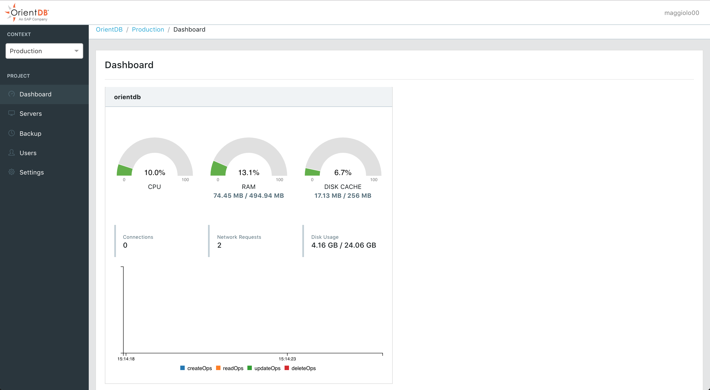

### Servers

On the top of the page you can chose your server, visualize its system information and then navigate all statistics and facts related to it through the available tabs.


#### Overview

This panel summarizes all the most important information about the selected server:

* `CPU` 
* `RAM` 
* `DISK CACHE`
* `DISK Usage`
* `Active Connections`
* `Network Request`
*  A `Live Chart` of CRUD operations in real time.

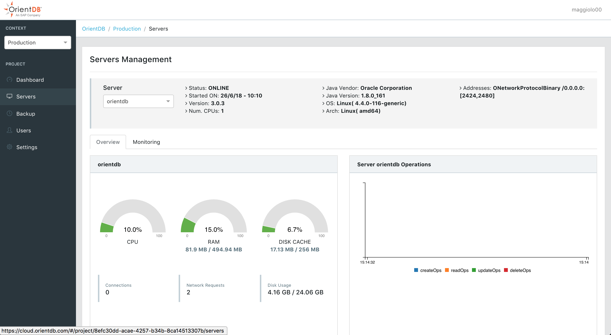

#### Monitoring

This panel contains two sections

* Connections
* Thread Dump

##### Connections

It displays all the active connections to the server. For each connection reports the following information:

- `Session ID`, as the unique session number
- `Address`, is the connection source
- `Database`, the database name used
- `User`, the database user
- `Total Requests`, as the total number of requests executed by the connection
- `Command Info`, as the running command
- `Command Detail`, as the detail about the running command
- `Last Command On`, is the last time a request has been executed
- `Last Command Info`, is the informaton about last operation executed
- `Last Command Detail`, is the informaton about the details of last operation executed
- `Last Execution Time`, is the execution time o last request
- `Total Working Time`, is the total execution time taken by current connection so far
- `Connected Since`, is the date when the connection has been created
- `Protocol`, is the protocol among [HTTP](../misc/OrientDB-REST.md) and [Binary](../internals/Network-Binary-Protocol.md)
- `Driver`, the driver name


##### Thread Dump

It displays the thread dump of the server.

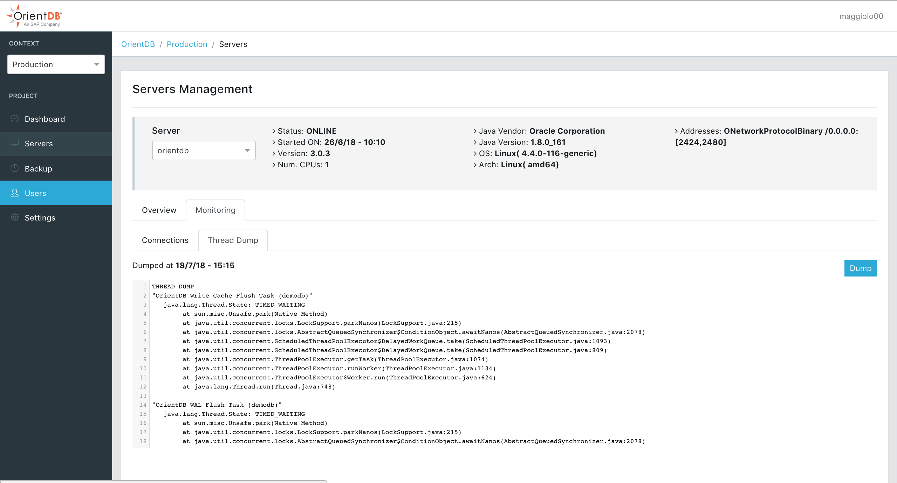

### Backup Restore


#### Backup Scheduling

In order to schedule a backup click on the "+" icon neare the list of available backups in the "Backup Management" panel.

As first thing choose the **database** that you want backup and a server where you want to schedule it. In the example above we have chosen the `demodb` database and `orientdb` server.
Then you must specify the **local directory** where you want to save your backups.

Now you must select the **backup mode** you want to use:
- **Full backup**
- **Incremental Backup**
- **Full + Incremental Backup**

These modes will be analysed afterwards.


Once you have chosen the desired backup mode, you have to choose the **backup period** that indicates the time you want to wait between each backup and the next one.
Eventually you must flag the **Enabled** checkbox and click on the **Save** button in order to start the scheduling of the backups according to your settings.

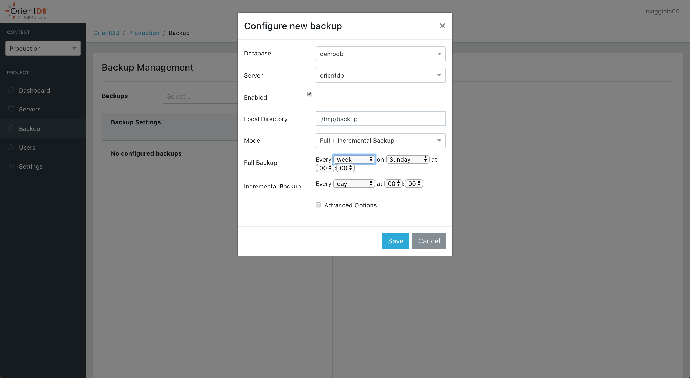

Below we will examine briefly the three different backup strategies.


#####Full backup
Through this mode when each period passes a **full backup** will be performed in the path you specified in the settings just discussed.
If you want know more about the full backup you can refer to the [Full Backup](../../admin/Backup-and-Restore.md) page.

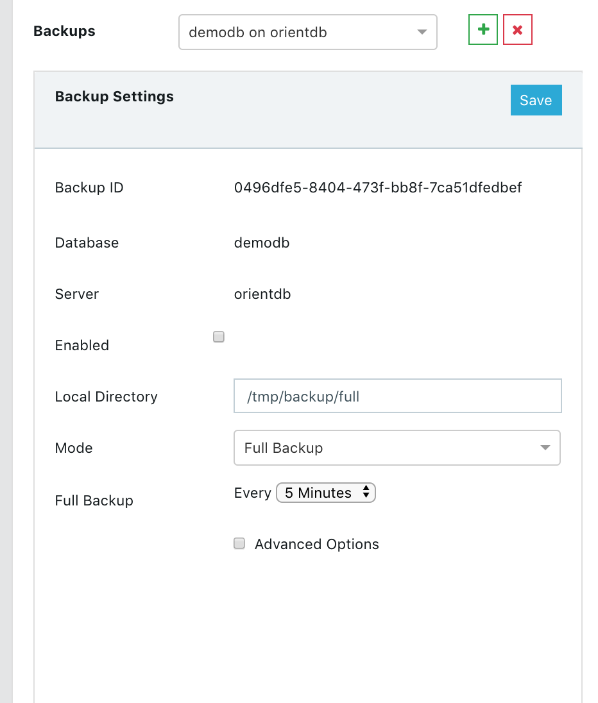

With the settings shown above a full backup will be performed every 5 minutes. Thus in our example after 5 minutes we will have the first backup, after 10 minutes the second one and so on.

```
/tmp/backup/full
          |
          |____________demodb-1465213003035                         
          |                      |____________demodb_2016-06-06-13-36-43_0_full.ibu
          |
          |____________demodb-1465213020008                         
          |                      |____________demodb_2016-06-06-13-37-00_0_full.ibu
          |
          |____________demodb-1465213080003                        
          |                      |____________demodb_2016-06-06-13-38-00_0_full.ibu
          ...
```


#####Incremental Backup
If you prefer to execute an **incremental backup** you can select this mode.
As declared in the [Incremental Backup](../admin/Incremental-Backup-And-Restore.md) page the incremental backup generates smaller backup files by storing only the **delta** between two versions of the database.
Let's suppose we want execute a backup every 5 minutes: a **first full backup** will be performed, then it will be followed by a new **incremental backup**, containing  only the delta, **every 5 minutes**.

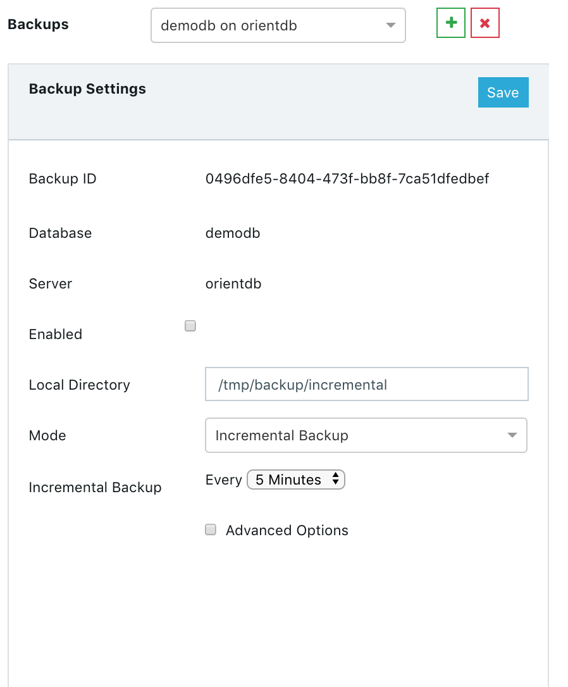

```
/tmp/backup/incremental
          |
          |____________demodb-incremental                         
                                |____________demodb_2016-06-06-13-27-00_0_full.ibu
                                |____________demodb_2016-06-06-13-28-00_1.ibu
                                |____________demodb_2016-06-06-13-29-00_2.ibu
                                |____________demodb_2016-06-06-13-30-00_3.ibu
                                |____________demodb_2016-06-06-13-31-00_4.ibu
                                ...

```


#####Full + Incremental Backup
This mode follows an **hybrid approach** between the first two strategies, combining them according to your criteria. The first significant thing you can notice is that **you must specify two different backup-periods**:
- **Full Backup period**: it specifies how much time will be waited between two sequential full backups.
- **Incremental Backup period**: it specifies how much time will be waited between two sequential incremental backups.

Let's analyse in which way the two modes are combined. Suppose we decided to execute the full backup every 5 minutes and the incremental backup every minute as shown in the example below.


Thus we will obtain that **every 5 minutes** a new directory with a **full backup** will be added in the specified path, then **in the following 4 minutes** only **incremental backups** will be performed. As we set 1 minute for the incremental backup, we will have 4 incremental backups after the first full backup.
After 5 minutes a new full backup in another folder will be performed, and the following incrementals will be executed according to the delta relative to this second full backup and they will put in this second folder.
That's all, after another 5 minutes we will have a third directory with an initial full backup that will be followed by 4 incremental backups, ans so on.

```
/tmp/backup/full-incremental
          |
          |____________demodb-1465213200182                         
          |                      |____________demodb_2016-06-06-13-40-00_0_full.ibu
          |                      |____________demodb_2016-06-06-13-41-00_1.ibu
          |                      |____________demodb_2016-06-06-13-42-00_2.ibu
          |                      |____________demodb_2016-06-06-13-44-00_3.ibu
          |                      |____________demodb_2016-06-06-13-44-00_4.ibu
          |
          |____________demodb-1465213440019                         
          |                      |____________demodb_2016-06-06-13-45-00_0_full.ibu
          |                      |____________demodb_2016-06-06-13-46-00_1.ibu
          |                      |____________demodb_2016-06-06-13-47-00_2.ibu
          |                      |____________demodb_2016-06-06-13-48-00_3.ibu
          |                      |____________demodb_2016-06-06-13-49-00_4.ibu
          |
          |____________demodb-1467210084991                         
          |                      |____________demodb_2016-06-06-13-46-00_0_full.ibu
          |                      ...
          ...
```

In this way we can have a "checkpoint" for each different directory to use in order to restore the database to a specific moment. You can decide if delete or maintain old backups and for each of them you can exploit the incremental backup features at the same time. To achieve this goal and use this feature properly mind that **full backup period must be major than incremental backup period**, different settings may cause illogical behaviours.

#####Granularity

You can have different granularities to schedule your backups. Besides **minutes** granularity you can choose **hour**, **day**, **week**, **month**, and **year** granularity.

##### Advanced configuration

You can choose to synchronize the backup with a remote server:

**SSH**

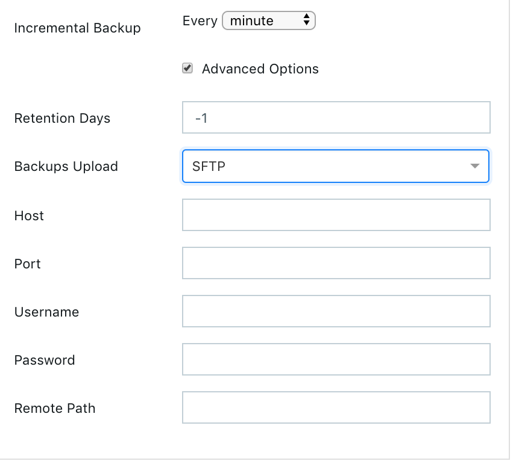 

**Amazon S3**

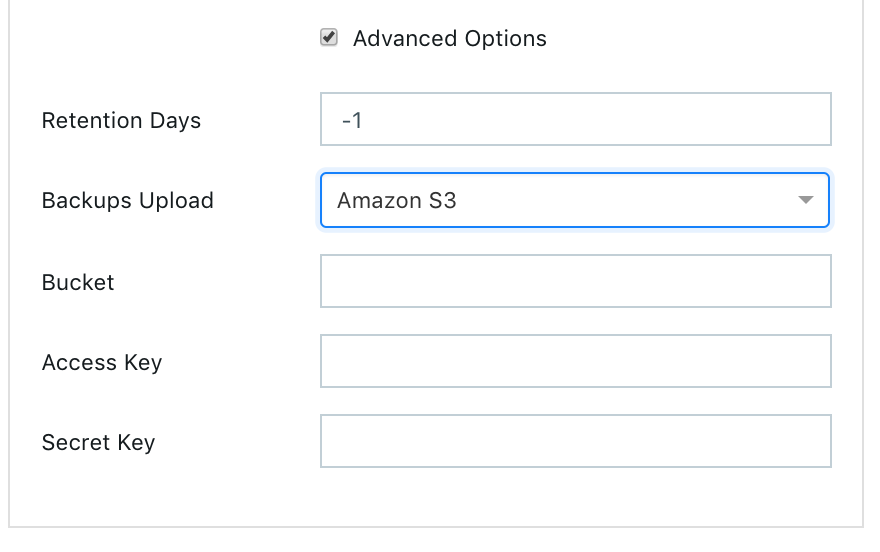 


#### Restore

In the calendar you can visualize and filter all the tasks (with the eventual related errors) through the voices below:
- Backup Finished
- Restore Finished
- Backup Scheduled
- Backup Started
- Restore Started
- Backup Error
- Restore Error


Notice you can choose three different scopes: **month**, **week** and **day**.

Clicking on a backup you can examine additional info like **execution time** and **timestamp**, **directory path**, **file name** and **file size**.
Moreover you can **remove** the backup or carry out a restore starting from it.  
**Use this way to delete your backups** because removing them manually may generates **unexpected behaviours**.

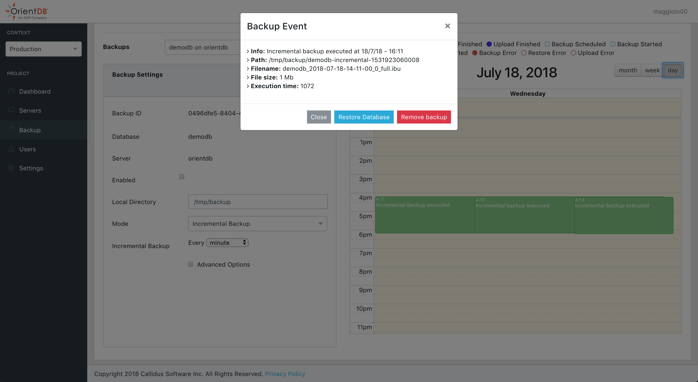 

Let's make a restore by clicking on the button "Restore Database". A new window will be opened.
Here you must **select the database where you want restore the backup**: notice you must declare just a name and a new empty database will be automatically created by the restore procedure, **don't use**:

- **an existent not-empty database**
- **fresh manually-built database**

Below are reported all the files involved in the restore procedure: the number of files used to restore your database depends on the **backup mode** you chose for the selected backup task.


 


### Users

By clicking "Users" in the sidebar menu of the Project panel you can view all the users associated within the selected project.


##### Add User

> To associate user to an project you must be an administrator of the project. 

1. Select an Project 
2. Go to the users list [page](#users)
3. Click "Add User"
4. Enter the email and the role for the user.
5. Click "Add User"

> Supported roles are Admin and Member. Member role are read only within the project.

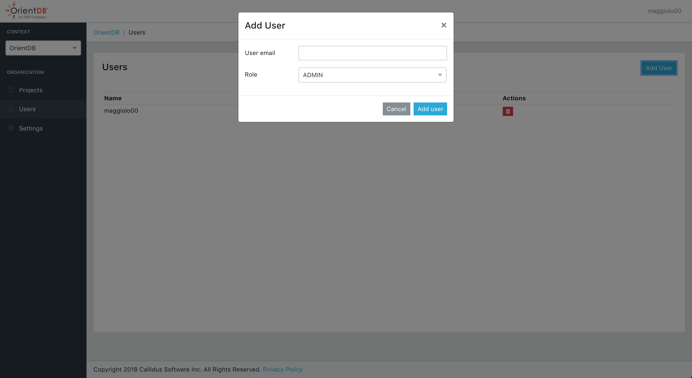


### Settings

#### General


#### Agent Tokens

Tokens are used to authenticate and associate OrientDB servers and Projects.

> A single token can be used by multiple servers in the same cluster.
Tokens should be considered as passwords and they are displayed only once, at generation time. 


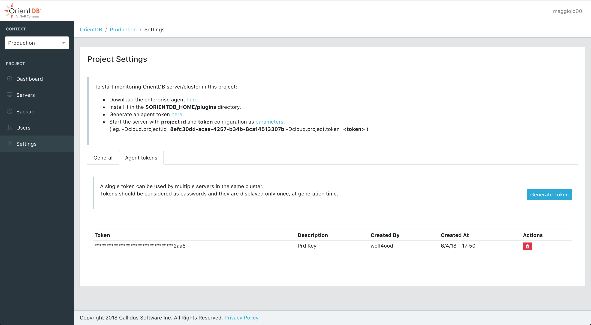

To generate a new token:

1. Click on "Generate Token" button
2. Fill the token description
3. Wait for the response and save the token in a secure location.
4. Use the token + project id to start monitorin OrientDB servers

> Tokens are displayed only once at creation time.

