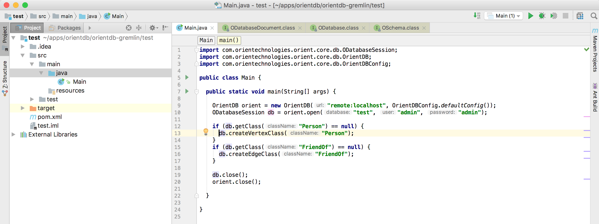

# OrientDB for Java Developers in Five Minutes

In the [previous step](java-2.md) you created your Java application scaffolding in IntelliJ Idea, now it's time to create a Java class that connects to the database and does basic operations

We will write a very simple application with two classes:

- **Person**: a vertex type containing information about people
- **FriendOf**: an edge class that connects people together

## Step 4/5 - Connect to the DB and create a basic schema

Let's create a simple Java class

- Open the folder **src** -> **main** -> **java**
- Right-click on the **java** folder and choose **New** -> **Java Class**


- Give the class the name you prefer and click **OK**
- create a *main* method

Now it's time to connect to OrientDB

- Create an OrientDB object to manage the remote server
- Also invoke a `close()` at the end of the method (so that you don't forget it later)

```java
    OrientDB orient = new OrientDB("remote:localhost", OrientDBConfig.defaultConfig());

    //let's do something with this server!
    
    orient.close();
```

The first argument of `OrientDB()` constructor is the URL of the remote database. It's made of two parts:
- `remote`: specifies that we are connecting to a remote (stand-alone) server
- `localhost`: the address of the host where OrientDB is running (it can be a URL or an IP, in this case orientdb is running on the local machine)


Until now, we just established a connection with the server, but not with the database itself (we created a db named *test*, do you remember?). 

Now it's time to open a database session (and remember to close it at the end!):

```java
    OrientDB orient = new OrientDB("remote:localhost", OrientDBConfig.defaultConfig());
    ODatabaseSession db = orient.open("test", "admin", "admin");
    
    //let's do something with this session!
    
    db.close();    
    orient.close();
```

Here we are actually connecting to the database. The three parameters are:
- `test`: the database name (we created it a couple of steps before)
- `admin` (the first one): the username used to connect
- `admin` (the second one): the password for the connection

By default, when you create a new database, OrientDB creates three users for you: `admin`, `reader`, `writer`; the passwords
for these users are the same as the user names, eg. the password for `admin` is `admin`. You can change it later of course, and you can
define more users if needed.

Now it's time to create a schema for our db. Do you remember? We are creating a graph of people who are friends, so we need a `Person` 
vertex class and a `FriendOf` edge class.

Let's also add a little check to make sure that the classes do not already exist

```java
    if (db.getClass("Person") != null) {
      db.createVertexClass("Person");
    }
    if (db.getClass("FriendOf") != null) {
      db.createEdgeClass("FriendOf");
    }
```

And this is the final version of our class



This is the full source code:

```java
import com.orientechnologies.orient.core.db.ODatabaseSession;
import com.orientechnologies.orient.core.db.OrientDB;
import com.orientechnologies.orient.core.db.OrientDBConfig;

public class Main {

  public static void main(String[] args) {

    OrientDB orient = new OrientDB("remote:localhost", OrientDBConfig.defaultConfig());
    ODatabaseSession db = orient.open("test", "admin", "admin");

    if (db.getClass("Person") == null) {
      db.createVertexClass("Person");
    }
    if (db.getClass("FriendOf") == null) {
      db.createEdgeClass("FriendOf");
    }

    db.close();
    orient.close();

  }

}
```

Now just run it and then open OrientDB Studio again:

- go back to the browser (OrientDB Studio)
- click on the **SCHEMA** tab

you will see the two newly created classes: `Person` and `FriendOf`


Just to make it a bit more realistic, let's also create some basic schema for our `Person` class. 

We will just add a `name` to the Person and we will create an index on it. 

```java
    OClass person = db.getClass("Person");

    if (person == null) {
      person = db.createVertexClass("Person");
    }
    
    if (person.getProperty("name") == null) {
      person.createProperty("name", OType.STRING);
      
      //                     index name                index type          property name
      person.createIndex("Person_name_index", OClass.INDEX_TYPE.NOTUNIQUE, "name");
    }

```

And this is the final result:

```java
import com.orientechnologies.orient.core.db.ODatabaseSession;
import com.orientechnologies.orient.core.db.OrientDB;
import com.orientechnologies.orient.core.db.OrientDBConfig;
import com.orientechnologies.orient.core.metadata.schema.OClass;
import com.orientechnologies.orient.core.metadata.schema.OType;

public class Main {

  public static void main(String[] args) {

    OrientDB orient = new OrientDB("remote:localhost", OrientDBConfig.defaultConfig());
    ODatabaseSession db = orient.open("test", "admin", "admin");

    OClass person = db.getClass("Person");

    if (person == null) {
      person = db.createVertexClass("Person");
    }
    
    if (person.getProperty("name") == null) {
      person.createProperty("name", OType.STRING);
      person.createIndex("Person_name_index", OClass.INDEX_TYPE.NOTUNIQUE, "name");
    }

    if (db.getClass("FriendOf") == null) {
      db.createEdgeClass("FriendOf");
    }

    db.close();
    orient.close();

  }
}
```


Now you are ready for the [Next Step - Create your First Graph and Run Queries >>>](java-4.md)
