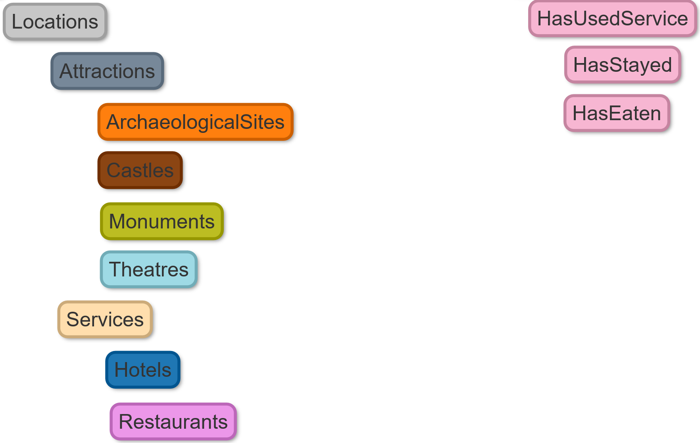

## Data Model

`demodb` is the database of an hypothetical Travel Agency that runs a public social platform as well.

Users (that are stored in the database in the class _Profiles_) can freely register to the social platform and start making friends (friendship is expressed via the _HasFriend_ edge).

Some of the users can become customers. When this happens the application in use at the Social Travel Agency creates a vertex in the _Customers_ class and links it to the associated profile via an _HasProfile_ edge.

When customers are created, they are automatically linked to a country as well, via an _IsFromCountry_ edge. Countries are stored in the _Countries_ vertex class.

Orders made by customers are stored in the vertex class _Orders_. Each customer can make one or more orders, and the _HasCustomer_ edge is used to connect orders to customers.

When customers start visiting _Attractions_ (like _Castles_, _Monuments_, _Theatres_ or _Archaeological Sites_) or using _Services_ (like _Hotels_ or _Restaurants_) edges are created to link that specific customer with that specific attraction or service (_HasVisited_, _HasStayed_, and _HasEaten_ edges are used).

The Social Travel Agency also stores some reviews in the vertex class _Reviews_. Reviews are linked to customers via the _MadeReview_ edge, and to an attraction or service via the _HasReview_ edge.

Data model of `demodb` v.{{book.demoDBVersion_screenshots}} is reported in the image below:

### Inheritance

Inheritance in the Vertex and Edge classes of `demodb` v.{{book.demoDBVersion_screenshots}} is reported in the image below:

