## Queries

Some query examples are reported below.

_Note:_ the screenshots included in this page have been taken with version {{ book.demoDBVersion_screenshots }} of the demo database. While the queries remain valid, future versions of the demo database may include different records.

The following table can help you navigate through all examples:

| PROFILES                                                                | FRIENDSHIP                                                               | LOCATIONS                                                                | REVIEWS | SERVICES | CUSTOMERS | ORDERS                                                                | RECOMMENDATIONS | BUSINESS OPPORTUNITIES                          | SHORTEST PATHS       | TRAVERSES            |POLYMORPHISM 
|-------------------------------------------------------------------------|--------------------------------------------------------------------------|--------------------------------------------------------------------------|---------|----------|-----------|-----------------------------------------------------------------------|-----------------|-------------------------------------------------|----------------------|----------------------|-----------------------------------------------------------------------------|
| {{ book.demodb_query_8_text }}  [Link](DemoDB.md#profiles---example-1)  | {{ book.demodb_query_1_text }}  [Link](DemoDB.md#friendship---example-1) | {{ book.demodb_query_15_text }}  [Link](DemoDB.md#locations---example-1) | |   |                          | {{ book.demodb_query_9_text }}   [Link](DemoDB.md#orders---example-1) |                 | {{book.demodb_query_7_text}}  [Link](DemoDB.md) |                      |                      | {{ book.demodb_query_17_text }}  [Link](DemoDB.md#polymorphism---example-1) |
| {{ book.demodb_query_12_text }} [Link](DemoDB.md#profiles---example-2)  | {{ book.demodb_query_2_text }}  [Link](DemoDB.md#friendship---example-2) | {{ book.demodb_query_16_text }}  [Link](DemoDB.md#locations---example-2) | |   |                          | {{ book.demodb_query_11_text }}  [Link](DemoDB.md#orders---example-2) |                 | {{book.demodb_query_14_text}} [Link](DemoDB.md) |||| 
|                                                                         | {{ book.demodb_query_3_text }}  [Link](DemoDB.md#friendship---example-3) | | |   |   |   |  |  |||| 
|                                                                         | {{ book.demodb_query_4_text }}  [Link](DemoDB.md#friendship---example-4) | | |   |   |   |  |  |||| 
|                                                                         | {{ book.demodb_query_5_text }}  [Link](DemoDB.md#friendship---example-5) | | |   |   |   |  |  |||| 
|                                                                         | {{ book.demodb_query_6_text }}  [Link](DemoDB.md#friendship---example-6) | | |   |   |   |  |  |||| 
|                                                                         | {{ book.demodb_query_7_text }}  [Link](DemoDB.md#friendship---example-7) | | |   |   |   |  |  |||| 
|                                                                         |   | | |   |   |   |  |  |||| 


### Tips


### PROFILES

#### Profiles - Example 1

{{ book.demodb_query_8_text }}:

In the _Browse Tab_ of [Studio](../studio/README.md), using the query below, this is the obtained list of records (only few records are shown in the image below):

<pre><code class="lang-sql">{{book.demodb_query_8_sql_browse}}</code></pre>


#### Profiles - Example 2

{{ book.demodb_query_12_text }}:

In the _Graph Editor_ included in [Studio](../studio/README.md), using the query below, this is the obtained graph:

<pre><code class="lang-sql">{{book.demodb_query_12_sql_graph}}</code></pre>


In the _Browse Tab_ of [Studio](../studio/README.md), using the query below, this is the obtained list of records:

<pre><code class="lang-sql">{{book.demodb_query_12_sql_browse}}</code></pre>


### FRIENDSHIP

#### Friendship - Example 1

{{book.demodb_query_1_text}}:

<pre><code class="lang-sql">{{book.demodb_query_1_sql}} 
{{book.demodb_query_1_return_graph}} 
</code></pre>

In the _Graph Editor_ included in [Studio](../studio/README.md), using '{{book.demodb_query_1_return_graph}}' as `RETURN` clause, this is the obtained graph:


In the _Browse Tab_ of [Studio](../studio/README.md), using '{{book.demodb_query_1_return_browse}}' as `RETURN` clause, this is the obtained list of records (only few records are shown in the image below):

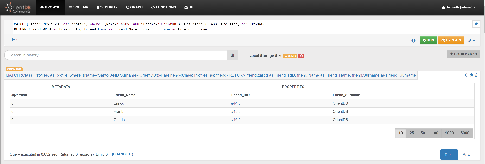

If you would like only to count them, you can execute a query like the following:

<pre><code class="lang-sql">{{book.demodb_query_13_sql_browse_method_1}}</code></pre>

or

<pre><code class="lang-sql">{{book.demodb_query_13_sql_browse_method_2}}</code></pre>


#### Friendship - Example 2

{{book.demodb_query_2_text}}:

<pre><code class="lang-sql">{{book.demodb_query_2_sql}} 
{{book.demodb_query_2_return_graph}} 
</code></pre>

In the _Graph Editor_ included in [Studio](../studio/README.md), using '{{book.demodb_query_2_return_graph}}' as `RETURN` clause, this is the obtained graph:

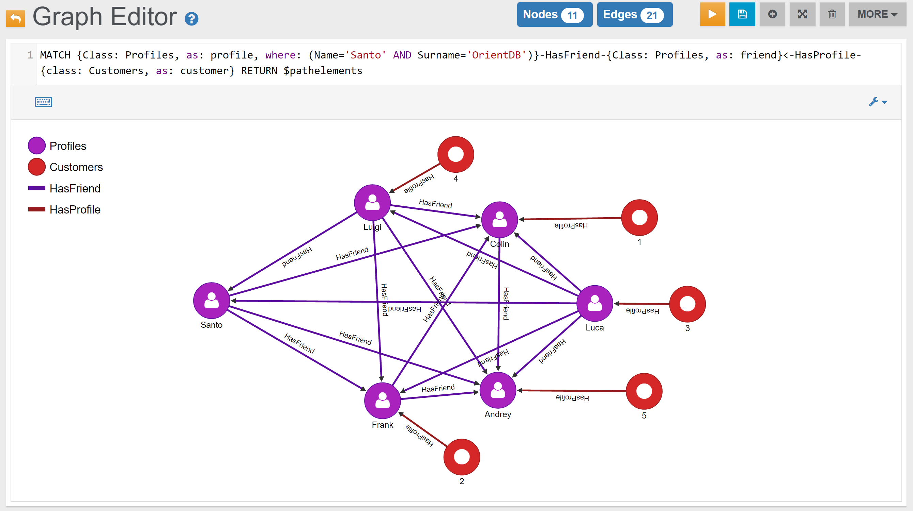

In the _Browse Tab_ of [Studio](../studio/README.md), using '{{book.demodb_query_2_return_browse}}' as `RETURN` clause, this is the obtained list of records (only few records are shown in the image below):


#### Friendship - Example 3

{{book.demodb_query_3_text}}:

<pre><code class="lang-sql">{{book.demodb_query_3_sql}} 
{{book.demodb_query_3_return_graph}} 
</code></pre>

In the _Graph Editor_ included in [Studio](../studio/README.md), using '{{book.demodb_query_3_return_graph}}' as `RETURN` clause, this is the obtained graph:


In the _Browse Tab_ of [Studio](../studio/README.md), using '{{book.demodb_query_3_return_browse}}' as `RETURN` clause, this is the obtained list of records (only few records are shown in the image below):

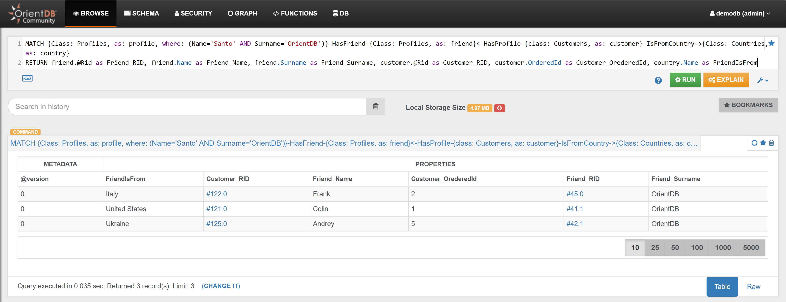


#### Friendship - Example 4

{{book.demodb_query_4_text}}:

<pre><code class="lang-sql">{{book.demodb_query_4_sql}} 
{{book.demodb_query_4_return_graph}} 
</code></pre>

In the _Graph Editor_ included in [Studio](../studio/README.md), using '{{book.demodb_query_4_return_graph}}' as `RETURN` clause, this is the obtained graph:


In the _Browse Tab_ of [Studio](../studio/README.md), using '{{book.demodb_query_4_return_browse}}' as `RETURN` clause, this is the obtained list of records (only few records are shown in the image below):


#### Friendship - Example 5

{{book.demodb_query_5_text}}:

In the _Graph Editor_ included in [Studio](../studio/README.md), using the query below, this is the obtained graph:

<pre><code class="lang-sql">{{book.demodb_query_5_sql_graph}}</code></pre>


In the _Browse Tab_ of [Studio](../studio/README.md), using the query below, this is the obtained list of records (only few records are shown in the image below):

<pre><code class="lang-sql">{{book.demodb_query_5_sql_browse}}{{book.demodb_query_5_sql_browse_part2}}</code></pre>


#### Friendship - Example 6

{{book.demodb_query_6_text}}:

In the _Graph Editor_ included in [Studio](../studio/README.md), using the query below, this is the obtained graph:

<pre><code class="lang-sql">{{book.demodb_query_6_sql_graph}}</code></pre>

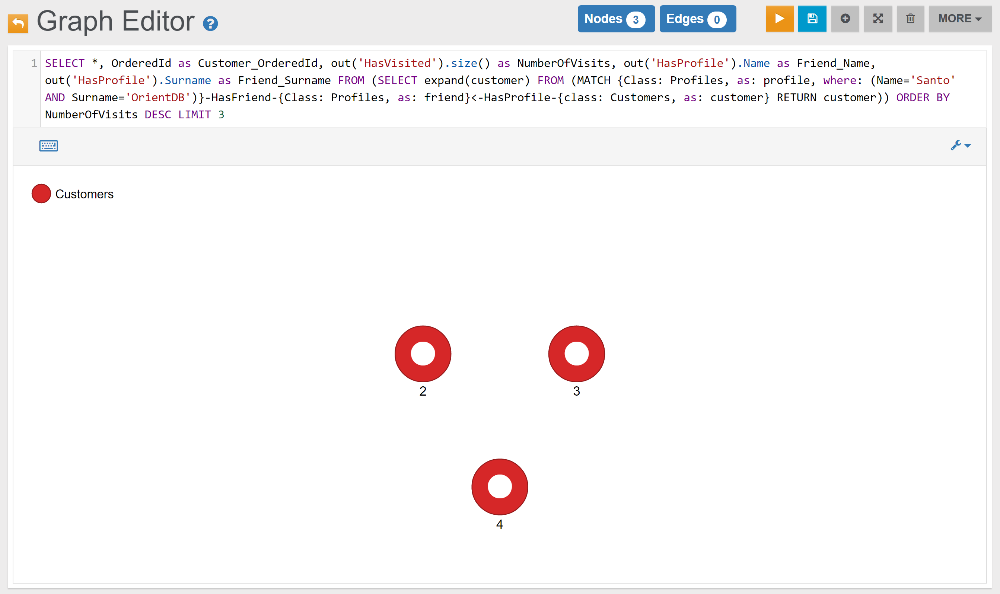

In the _Browse Tab_ of [Studio](../studio/README.md), using the query below, this is the obtained list of records (only few records are shown in the image below):

<pre><code class="lang-sql">{{book.demodb_query_6_sql_browse}}</code></pre>


You may find in a similar way the top 3 Customers, among Santo's Friends, that have stayed at the highest number of Hotels, or have eaten at the highest number of Restaurants. Just use `out("HasStayed").size()` or `out("HasEaten").size()` instead of `out("HasVisited").size()` (you may also consider to modify the alias, from `NumberOfVisits` to `NumberOfHotels` and `NumberOfRestaurants`, so that it is more coherent to these cases).


#### Friendship - Example 7

{{book.demodb_query_7_text}}:

In the _Graph Editor_ included in [Studio](../studio/README.md), using the query below, this is the obtained graph:

<pre><code class="lang-sql">{{book.demodb_query_7_sql_graph}}</code></pre>


In the _Browse Tab_ of [Studio](../studio/README.md), using the query below, this is the obtained list of records (only few records are shown in the image below):

<pre><code class="lang-sql">{{book.demodb_query_7_sql_browse}}</code></pre>


or, without restricting to a specific customer:

{{book.demodb_query_14_text}}:

In the _Graph Editor_ included in [Studio](../studio/README.md), using the query below, this is the obtained graph:

<pre><code class="lang-sql">{{book.demodb_query_14_sql_graph}}</code></pre>


In the _Browse Tab_ of [Studio](../studio/README.md), using the query below, this is the obtained list of records (only few records are shown in the image below):

<pre><code class="lang-sql">{{book.demodb_query_14_sql_browse}}</code></pre>


### LOCATIONS 

#### Locations - Example 1 

{{book.demodb_query_15_text}}:

<pre><code class="lang-sql">{{book.demodb_query_15_sql}} 
{{book.demodb_query_15_return_graph}} 
</code></pre>

In the _Graph Editor_ included in [Studio](../studio/README.md), using '{{book.demodb_query_15_return_graph}}' as `RETURN` clause, this is the obtained graph:

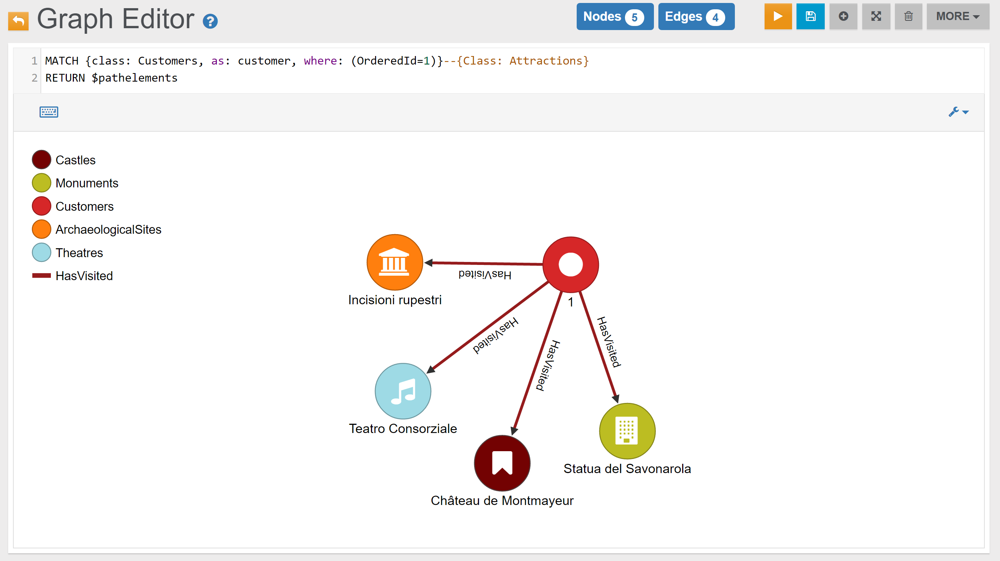

In the _Browse Tab_ of [Studio](../studio/README.md), using '{{book.demodb_query_15_return_browse}}' as `RETURN` clause, this is the obtained list of records (only few records are shown in the image below):

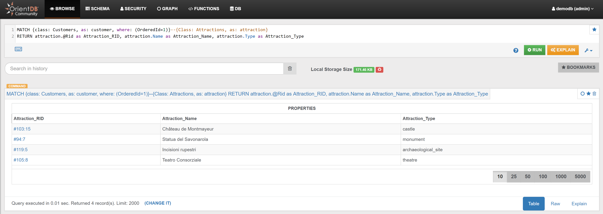


#### Locations - Example 2

{{book.demodb_query_16_text}}:

<pre><code class="lang-sql">{{book.demodb_query_16_sql}} 
{{book.demodb_query_16_return_graph}} 
</code></pre>

In the _Graph Editor_ included in [Studio](../studio/README.md), using '{{book.demodb_query_16_return_graph}}' as `RETURN` clause, this is the obtained graph:


In the _Browse Tab_ of [Studio](../studio/README.md), using '{{book.demodb_query_16_return_browse}}' as `RETURN` clause, this is the obtained list of records (only few records are shown in the image below):

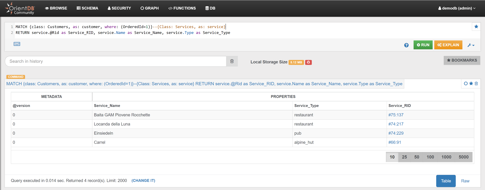


#### Example 3

Find all Locations visited by Customer with OrderedId 2
```sql
MATCH {as: n}<-HasVisited-{class: Customers, as: customer, where: (OrderedId=1)} 
RETURN $pathelements
```

#### Example 4

Find all Locations visited by Santo's friends
```sql
MATCH {Class: Profiles, as: profile, where: (Name='Santo' and Surname='OrientDB')}-HasFriend->{Class: Profiles, as: friend}<-HasProfile-{Class: Customers, as: customer}-HasVisited->{Class: Locations, as: location} 
RETURN $pathelements
```


### POLYMORPHISM 

#### Polymorphism - Example 1

{{book.demodb_query_17_text}}:

<pre><code class="lang-sql">{{book.demodb_query_17_sql}} 
{{book.demodb_query_17_return_graph}} 
</code></pre>

In the _Graph Editor_ included in [Studio](../studio/README.md), using '{{book.demodb_query_17_return_graph}}' as `RETURN` clause, this is the obtained graph:


In the _Browse Tab_ of [Studio](../studio/README.md), using '{{book.demodb_query_17_return_browse}}' as `RETURN` clause, this is the obtained list of records (only few records are shown in the image below):

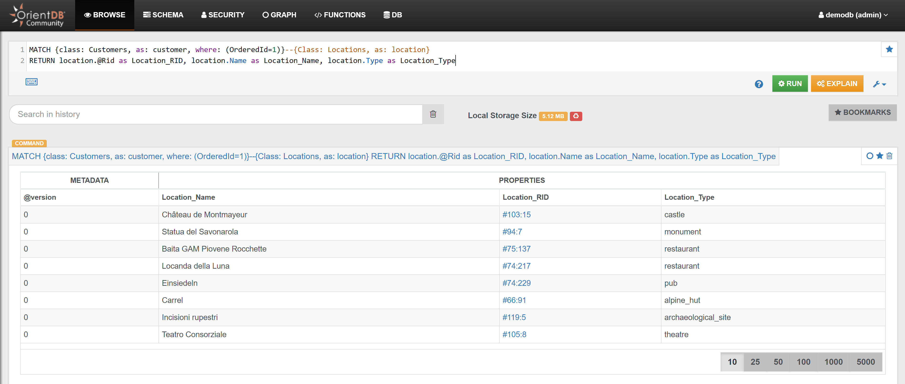


#### Polymorphism - Example 2


### REVIEWS 

#### Example 1

Find number of reviews per star
```sql
SELECT Stars, count(*) as count FROM HasReview GROUP BY Stars ORDER BY count DESC
```

#### Example 2

Find all reviewed Services
```sql
MATCH {class: Services, as: s}-HasReview->{class: Reviews, as: r} 
RETURN $pathelements
```

#### Example 3

Find all reviewed Services and the Customer who made the review 
```sql
MATCH {class: Services, as: s}-HasReview->{class: Reviews, as: r}<-MadeReview-{class: Customers, as: c} 
RETURN $pathelements 
```

#### Example 4

Find the numbers of reviews per Service 
```sql
SELECT *, out("HasReview").size() AS ReviewNumbers FROM `Services` ORDER BY ReviewNumbers DESC 
```

#### Example 5

**Example 5.1**

Find the 3 Places that have most reviews
```sql
SELECT *, out("HasReview").size() AS ReviewNumbers FROM `Services` ORDER BY ReviewNumbers DESC LIMIT 3
```

**Example 5.2**

Find the 3 Hotels that have most reviews 
```sql
SELECT *, out("HasReview").size() AS ReviewNumbers FROM `Hotels` ORDER BY ReviewNumbers DESC LIMIT 3
```

**Example 5.3**

Find the 3 Restaurants that have most reviews 
```sql
SELECT *, out("HasReview").size() AS ReviewNumbers FROM `Restaurants` ORDER BY ReviewNumbers DESC LIMIT 3
```

#### Example 6

Find the 3 Customers who made more reviews

```sql
SELECT *, out("MadeReview").size() AS ReviewNumbers FROM `Customers` ORDER BY ReviewNumbers DESC LIMIT 3
```

### SERVICES 

#### Example 1

**Example 1.1**

Find the 3 Hotels that have been booked most times
```sql
SELECT *, in("HasStayed").size() AS NumberOfBookings FROM Hotels ORDER BY NumberOfBookings DESC LIMIT 3
```

**Example 1.2**

Find the 3 Restaurants that have been used most times
```sql
SELECT *, in("HasEaten").size() AS VisitsNumber FROM Restaurants ORDER BY VisitsNumber DESC LIMIT 3
```

for the visualization in Studio:
{{Name}} ({{NumberOfBookings}})

#### Example 2

**Example 1.1**

Find the 3 Hotels that have most reviews 
```sql
SELECT *, out("HasReview").size() AS ReviewNumbers FROM `Hotels` ORDER BY ReviewNumbers DESC LIMIT 3
```

**Example 1.2**

Find the 3 Restaurants that have most reviews 
```sql
SELECT *, out("HasReview").size() AS ReviewNumbers FROM `Restaurants` ORDER BY ReviewNumbers DESC LIMIT 3
```

#### Example 3

**Example 1.1**

Find the top 3 nationality of the tourists that eaten at Restaurant with Id 13
```sql
SELECT Name, count(*) as CountryCount FROM (SELECT expand(out('IsFromCountry')) AS countries FROM ( SELECT expand(in("HasEaten")) AS customers FROM Restaurants WHERE Id='13' UNWIND customers) unwind countries) GROUP BY Name ORDER BY CountryCount DESC LIMIT 3
```

**Example 1.2**

Find the top 3 nationality of the tourists that staied at Hotel with Id 13
```sql
SELECT Name, count(*) as CountryCount FROM (SELECT expand(out('IsFromCountry')) AS countries FROM ( SELECT expand(in("HasStayed")) AS customers FROM Hotels WHERE Id='13' UNWIND customers) unwind countries) GROUP BY Name ORDER BY CountryCount DESC LIMIT 3
```

### CUSTOMERS 
	
#### Example 1

Find everything that is connected (1st degree) to Customer with Id 1 
```sql
MATCH {class: Customers, as: c, where: (OrderedId=1)}--{as: n} RETURN $pathelements
```
#### Example 2

Find all Orders placed by Customer with Id 1  
```sql
MATCH {class: Customers, as: c, where: (OrderedId=1)}<-HasCustomer-{class: Orders, as: o} 
RETURN $pathelements
```
#### Example 3

Find the 3 Customers who placed most Orders
```sql
SELECT *, in("HasCustomer").size() AS NumberOfOrders FROM Customers ORDER BY NumberOfOrders DESC LIMIT 3
```
#### Example 4

Find all Locations connected to Customer with Id 1
```sql
MATCH {class: Customers, as: customer, where: (OrderedId=1)}--{Class: Locations} 
RETURN $pathelements
```	
#### Example 5

Find all Locations connected to Customer with Id 2, and their Reviews (if any) 
```sql
MATCH {class: Customers, as: c, where: (OrderedId=2)}--{class: Locations, as: loc}-HasReview-{class: Reviews, as: r, optional: true} 
RETURN $pathelements
```
#### Example 6

Find the other Customers that visited the Locations visited by Customer with Id 1
```sql
MATCH {class: Customers, as: c, where: (OrderedId=1)}--{class: Locations, as: loc}--{class: Customers, as: otherCustomers, where: (OrderedId<>1)} 
RETURN otherCustomers.OrderedId, loc.Name, loc.Type
```
#### Example 7

Same as before, but now returns also their Profile names, surnames and emails 
```sql
MATCH {class: Customers, as: c, where: (OrderedId=1)}--{class: Locations, as: loc}--{class: Customers, as: otherCustomers, where: (OrderedId<>1)}-HasProfile->{class: Profiles, as: profile} 
RETURN otherCustomers.OrderedId, loc.Name, loc.Type, profile.Name, profile.Surname, profile.Email
```
#### Example 8

Find all the places where Customer with Id 1 has stayed
```sql
MATCH {as: n}<-HasStayed-{class: Customers, as: c, where: (OrderedId=1)} 
RETURN $pathelements
```
#### Example 9

Find all places where Customer with Id 1 has eaten
```sql
MATCH {as: n}-HasEaten-{class: Customers, as: c, where: (OrderedId=1)} 
RETURN $pathelements
```

#### Example 10


Find the 3 Customers who made more reviews

```sql
SELECT *, out("MadeReview").size() AS ReviewNumbers FROM `Customers` ORDER BY ReviewNumbers DESC LIMIT 3
```

### ORDERS

#### Orders - Example 1

{{book.demodb_query_9_text}}:

<pre><code class="lang-sql">{{book.demodb_query_9_sql_browse}}</code></pre>

In the _Browse Tab_ of [Studio](../studio/README.md), using the query above, this is the visualized result:


#### Orders - Example 2

{{book.demodb_query_11_text}}:

<pre><code class="lang-sql">{{book.demodb_query_11_sql_browse}}</code></pre>

In the _Browse Tab_ of [Studio](../studio/README.md), using the query above, this is the visualized result:

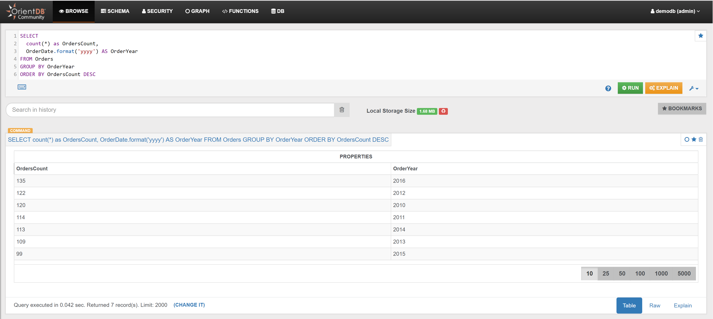


### RECOMMENDATIONS

#### Example 1

Recommend some friends to Profile with Id 1 (friends of friends)
```sql
MATCH {class: Profiles, as: profile, where: (Id=1)}.both('HasFriend').both('HasFriend'){as: friendOfFriend, where: ($matched.profile != $currentMatch)} 
RETURN profile, friendOfFriend 
```
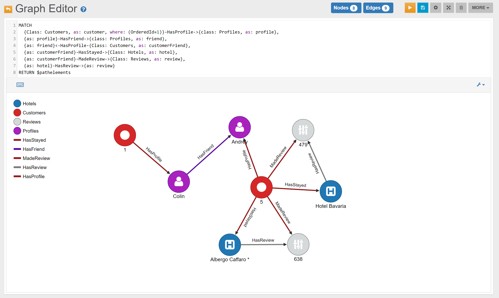


#### Example 2

Recommend some Hotels to Customer with OrderedId 1	
```sql
MATCH 
  {Class: Customers, as: customer, where: (OrderedId=1)}-HasProfile->{class: Profiles, as: profile},
  {as: profile}-HasFriend->{class: Profiles, as: friend},
  {as: friend}<-HasProfile-{Class: Customers, as: customerFriend},
  {as: customerFriend}-HasStayed->{Class: Hotels, as: hotel},
  {as: customerFriend}-MadeReview->{Class: Reviews, as: review},
  {as: hotel}-HasReview->{as: review}
RETURN $pathelements
```

To filter additionally, and suggest only the 4 and 5-rated hotels, it is possible to add a filter condition on the 'HasReview' edge (property 'Stars'):

```sql
MATCH
  {Class: Customers, as: customer, where: (OrderedId=1)}-HasProfile->{class: Profiles, as: profile},
  {as: profile}-HasFriend->{class: Profiles, as: friend},
  {as: friend}<-HasProfile-{Class: Customers, as: customerFriend},
  {as: customerFriend}-HasStayed->{Class: Hotels, as: hotel},
  {as: customerFriend}-MadeReview->{Class: Reviews, as: review},
  {as: hotel}.outE('HasReview'){as: ReviewStars, where: (Stars>3)}.inV(){as: review}
RETURN hotel, ReviewStars.Stars  
```

### SHORTEST PATHS

#### Example 1
 
Find the shortest path between the Profile 'Santo' and the Country 'United States':

```sql
SELECT expand(path) FROM (
  SELECT shortestPath($from, $to) AS path 
  LET $from = (SELECT FROM Profiles WHERE Name='Santo' and Surname='OrientDB'), $to = (SELECT FROM Countries WHERE Name='United States') 
  UNWIND path
)
```


### TRAVERSES

#### Example 1

```sql
TRAVERSE * FROM (
  SELECT FROM Profiles WHERE Name='Santo' and Surname='OrientDB'
) MAXDEPTH 3
```

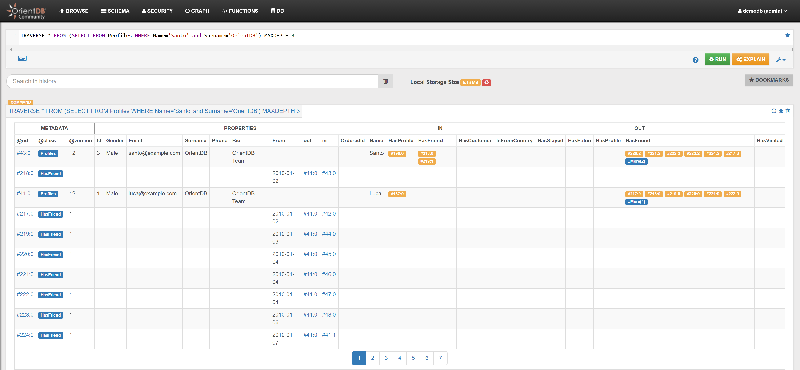


#### Example 2

```sql
TRAVERSE * FROM (
  SELECT FROM Countries WHERE Name='Italy'
) MAXDEPTH 3
```


