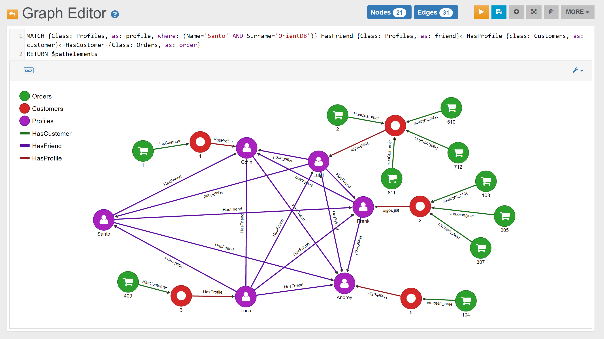

# Friendship

## Example 1

Find Santo's Friends:

```sql
MATCH {Class: Profiles, as: profile, where: (Name='Santo' AND Surname='OrientDB')}-HasFriend-{Class: Profiles, as: friend} 
RETURN $pathelements
```

In the _Graph Editor_ included in [Studio](../../../studio/README.md), using _'RETURN $pathelements'_ as `RETURN` clause, this is the obtained graph:


In the _Browse Tab_ of [Studio](../../../studio/README.md), using _'RETURN friend.@Rid as Friend_RID, friend.Name as Friend_Name, friend.Surname as Friend_Surname'_ as `RETURN` clause, this is the obtained list of records (only few records are shown in the image below):


If you would like only to count them, you can execute a query like the following:

<pre><code class="lang-sql">SELECT COUNT(*) 
FROM (
  MATCH {Class: Profiles, as: profile, where: (Name='Santo' AND Surname='OrientDB')}-HasFriend-{Class: Profiles, as: friend} RETURN friend
)
</code></pre>

or

<pre><code class="lang-sql">SELECT 
  (in('HasFriend').size() + out('HasFriend').size()) AS FriendsNumber 
FROM `Profiles` 
WHERE Name='Santo' AND Surname='OrientDB'
</code></pre>


## Example 2

Find Santo's Friends who are also Customers:

```sql
MATCH {Class: Profiles, as: profile, where: (Name='Santo' AND Surname='OrientDB')}-HasFriend-{Class: Profiles, as: friend}<-HasProfile-{class: Customers, as: customer}
RETURN $pathelements
```

In the _Graph Editor_ included in [Studio](../../../studio/README.md), using _'RETURN $pathelements'_ as `RETURN` clause, this is the obtained graph:


In the _Browse Tab_ of [Studio](../../../studio/README.md), using _'RETURN friend.@Rid as Friend_RID, friend.Name as Friend_Name, friend.Surname as Friend_Surname, customer.@Rid as Customer_RID, customer.OrderedId as Customer_OrederedId'_ as `RETURN` clause, this is the obtained list of records (only few records are shown in the image below):


## Example 3




## Example 4

Find Santo's Friends who are also Customers, and the Orders they have placed:

```sql
MATCH {Class: Profiles, as: profile, where: (Name='Santo' AND Surname='OrientDB')}-HasFriend-{Class: Profiles, as: friend}<-HasProfile-{class: Customers, as: customer}<-HasCustomer-{Class: Orders, as: order} 
RETURN $pathelements
```

In the _Graph Editor_ included in [Studio](../../../studio/README.md), using _'RETURN $pathelements'_ as `RETURN` clause, this is the obtained graph:



In the _Browse Tab_ of [Studio](../../../studio/README.md), using _'RETURN friend.@Rid as Friend_RID, friend.Name as Friend_Name, friend.Surname as Friend_Surname, customer.@Rid as Customer_RID, customer.OrderedId as Customer_OrederedId, order.Id as OrderId'_ as `RETURN` clause, this is the obtained list of records (only few records are shown in the image below):


## Example 5

Among Santo's Friends, find the top 3 Customers that placed the highest number of Orders:

```sql
SELECT 
  OrderedId as Customer_OrderedId, 
  in('HasCustomer').size() as NumberOfOrders, 
  out('HasProfile').Name as Friend_Name, 
  out('HasProfile').Surname as Friend_Surname 
FROM (
  SELECT expand(customer) 
  FROM (
    MATCH {Class: Profiles, as: profile, where: (Name='Santo' AND Surname='OrientDB')}-HasFriend-{Class: Profiles, as: friend}<-HasProfile-{class: Customers, as: customer} RETURN customer
  )
) 
ORDER BY NumberOfOrders DESC 
LIMIT 3
```

In the _Browse Tab_ of [Studio](../../../studio/README.md), using the query above, this is the obtained list of records (only few records are shown in the image below):


## Example 6

Among Santo's Friends, find the top 3 Customers that visited the highest number of Places:

```sql
SELECT 
  OrderedId as Customer_OrderedId, 
  out('HasVisited').size() as NumberOfVisits, 
  out('HasProfile').Name as Friend_Name, 
  out('HasProfile').Surname as Friend_Surname 
FROM (
  SELECT expand(customer) 
  FROM (
    MATCH {Class: Profiles, as: profile, where: (Name='Santo' AND Surname='OrientDB')}-HasFriend-{Class: Profiles, as: friend}<-HasProfile-{class: Customers, as: customer} RETURN customer
  )
) 
ORDER BY NumberOfVisits DESC 
LIMIT 3
```

In the _Browse Tab_ of [Studio](../../../studio/README.md), using the query above, this is the obtained list of records (only few records are shown in the image below):


You may find in a similar way the top 3 Customers, among Santo's Friends, that have stayed at the highest number of Hotels, or have eaten at the highest number of Restaurants. Just use `out("HasStayed").size()` or `out("HasEaten").size()` instead of `out("HasVisited").size()` (you may also consider to modify the alias, from `NumberOfVisits` to `NumberOfHotels` and `NumberOfRestaurants`, so that it is more coherent to these cases).


## Example 7



or, without restricting to a specific customer:

Find all the Customer Friends that are not Customers (so that a product can be proposed):

In the _Graph Editor_ included in [Studio](../../../studio/README.md), using the query below, this is the obtained graph:

<pre><code class="lang-sql">SELECT * FROM (SELECT expand(customerFriend) FROM ( MATCH {Class:Customers, as: customer}-HasProfile-{Class:Profiles, as: profile}-HasFriend-{Class:Profiles, as: customerFriend} RETURN customerFriend)) WHERE in('HasProfile').size()=0</code></pre>


In the _Browse Tab_ of [Studio](../../../studio/README.md), using the query below, this is the obtained list of records (only few records are shown in the image below):

<pre><code class="lang-sql">SELECT @Rid as Friend_RID, Name as Friend_Name, Surname as Friend_Surname FROM (SELECT expand(customerFriend) FROM ( MATCH {Class:Customers, as: customer}-HasProfile-{Class:Profiles, as: profile}-HasFriend-{Class:Profiles, as: customerFriend} RETURN customerFriend)) WHERE in('HasProfile').size()=0</code></pre>


