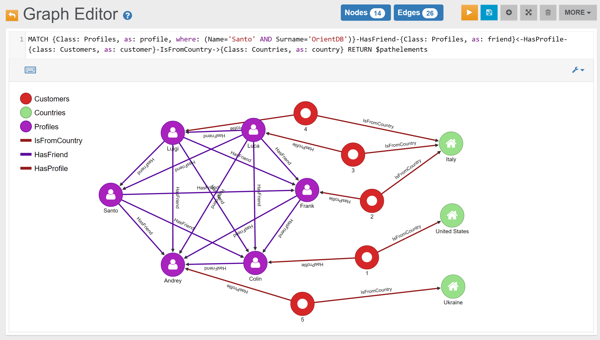
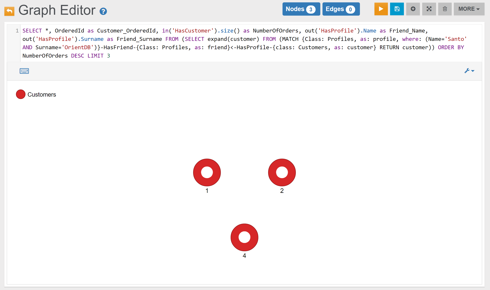
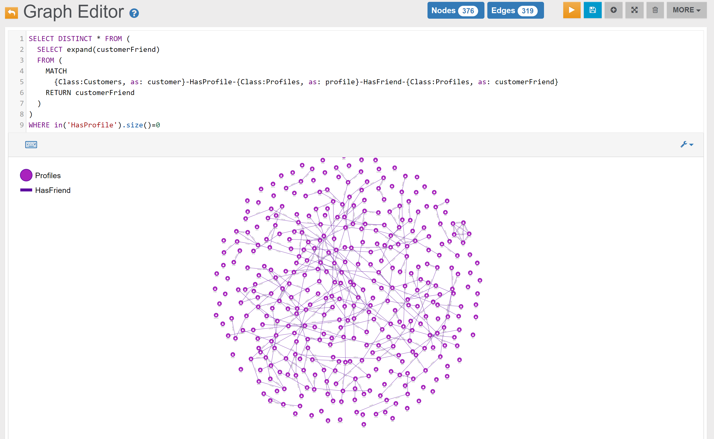
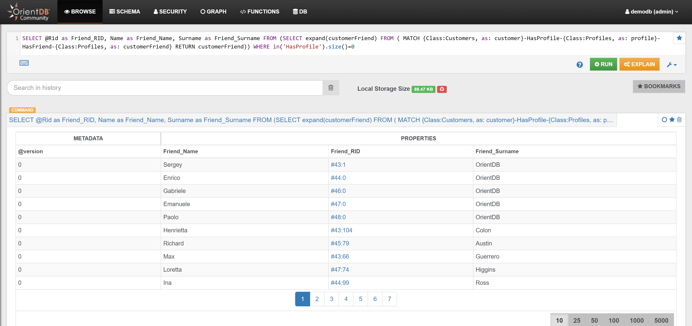

### Friendship

#### Example 1

{{book.demodb_query_1_text}}:

<pre><code class="lang-sql">{{book.demodb_query_1_sql}} 
{{book.demodb_query_1_return_graph}} 
</code></pre>

In the _Graph Editor_ included in [Studio](../studio/README.md), using '{{book.demodb_query_1_return_graph}}' as `RETURN` clause, this is the obtained graph:

In the _Browse Tab_ of [Studio](../studio/README.md), using '{{book.demodb_query_1_return_browse}}' as `RETURN` clause, this is the obtained list of records (only few records are shown in the image below):

If you would like only to count them, you can execute a query like the following:

<pre><code class="lang-sql">{{book.demodb_query_13_sql_browse_method_1}}</code></pre>

or

<pre><code class="lang-sql">{{book.demodb_query_13_sql_browse_method_2}}</code></pre>

#### Example 2

{{book.demodb_query_2_text}}:

<pre><code class="lang-sql">{{book.demodb_query_2_sql}} 
{{book.demodb_query_2_return_graph}} 
</code></pre>

In the _Graph Editor_ included in [Studio](../studio/README.md), using '{{book.demodb_query_2_return_graph}}' as `RETURN` clause, this is the obtained graph:

In the _Browse Tab_ of [Studio](../studio/README.md), using '{{book.demodb_query_2_return_browse}}' as `RETURN` clause, this is the obtained list of records (only few records are shown in the image below):

#### Example 3

{{book.demodb_query_3_text}}:

<pre><code class="lang-sql">{{book.demodb_query_3_sql}} 
{{book.demodb_query_3_return_graph}} 
</code></pre>

In the _Graph Editor_ included in [Studio](../studio/README.md), using '{{book.demodb_query_3_return_graph}}' as `RETURN` clause, this is the obtained graph:

In the _Browse Tab_ of [Studio](../studio/README.md), using '{{book.demodb_query_3_return_browse}}' as `RETURN` clause, this is the obtained list of records (only few records are shown in the image below):

#### Example 4

{{book.demodb_query_4_text}}:

<pre><code class="lang-sql">{{book.demodb_query_4_sql}} 
{{book.demodb_query_4_return_graph}} 
</code></pre>

In the _Graph Editor_ included in [Studio](../studio/README.md), using '{{book.demodb_query_4_return_graph}}' as `RETURN` clause, this is the obtained graph:

In the _Browse Tab_ of [Studio](../studio/README.md), using '{{book.demodb_query_4_return_browse}}' as `RETURN` clause, this is the obtained list of records (only few records are shown in the image below):

#### Example 5

{{book.demodb_query_5_text}}:

In the _Graph Editor_ included in [Studio](../studio/README.md), using the query below, this is the obtained graph:

<pre><code class="lang-sql">{{book.demodb_query_5_sql_graph}}</code></pre>

In the _Browse Tab_ of [Studio](../studio/README.md), using the query below, this is the obtained list of records (only few records are shown in the image below):

<pre><code class="lang-sql">{{book.demodb_query_5_sql_browse}}<{{book.demodb_query_5_sql_browse_part_2}}</code></pre>

test:
<pre><code class="lang-sql">{{book.demodb_query_5_sql_browse_part_2}}</code></pre>

#### Example 6

{{book.demodb_query_6_text}}:

In the _Graph Editor_ included in [Studio](../studio/README.md), using the query below, this is the obtained graph:

<pre><code class="lang-sql">{{book.demodb_query_6_sql_graph}}</code></pre>

In the _Browse Tab_ of [Studio](../studio/README.md), using the query below, this is the obtained list of records (only few records are shown in the image below):

<pre><code class="lang-sql">{{book.demodb_query_6_sql_browse}}</code></pre>

You may find in a similar way the top 3 Customers, among Santo's Friends, that have stayed at the highest number of Hotels, or have eaten at the highest number of Restaurants. Just use `out("HasStayed").size()` or `out("HasEaten").size()` instead of `out("HasVisited").size()` (you may also consider to modify the alias, from `NumberOfVisits` to `NumberOfHotels` and `NumberOfRestaurants`, so that it is more coherent to these cases).

#### Example 7

{{book.demodb_query_7_text}}:

In the _Graph Editor_ included in [Studio](../studio/README.md), using the query below, this is the obtained graph:

<pre><code class="lang-sql">{{book.demodb_query_7_sql_graph}}</code></pre>

In the _Browse Tab_ of [Studio](../studio/README.md), using the query below, this is the obtained list of records (only few records are shown in the image below):

<pre><code class="lang-sql">{{book.demodb_query_7_sql_browse}}</code></pre>

or, without restricting to a specific customer:

{{book.demodb_query_14_text}}:

In the _Graph Editor_ included in [Studio](../studio/README.md), using the query below, this is the obtained graph:

<pre><code class="lang-sql">{{book.demodb_query_14_sql_graph}}</code></pre>

In the _Browse Tab_ of [Studio](../studio/README.md), using the query below, this is the obtained list of records (only few records are shown in the image below):

<pre><code class="lang-sql">{{book.demodb_query_14_sql_browse}}</code></pre>

