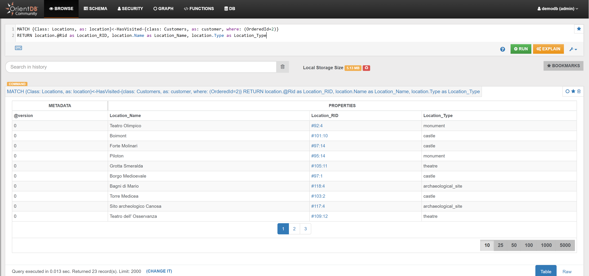

### Locations 

#### Example 1 

{{book.demodb_query_15_text}}:

<pre><code class="lang-sql">{{book.demodb_query_15_sql}} 
{{book.demodb_query_15_return_graph}} 
</code></pre>

In the _Graph Editor_ included in [Studio](../studio/README.md), using '{{book.demodb_query_15_return_graph}}' as `RETURN` clause, this is the obtained graph:


In the _Browse Tab_ of [Studio](../studio/README.md), using '{{book.demodb_query_15_return_browse}}' as `RETURN` clause, this is the obtained list of records (only few records are shown in the image below):


#### Example 2

{{book.demodb_query_16_text}}:

<pre><code class="lang-sql">{{book.demodb_query_16_sql}} 
{{book.demodb_query_16_return_graph}} 
</code></pre>

In the _Graph Editor_ included in [Studio](../studio/README.md), using '{{book.demodb_query_16_return_graph}}' as `RETURN` clause, this is the obtained graph:


In the _Browse Tab_ of [Studio](../studio/README.md), using '{{book.demodb_query_16_return_browse}}' as `RETURN` clause, this is the obtained list of records (only few records are shown in the image below):


#### Example 3

{{book.demodb_query_18_text}}:

<pre><code class="lang-sql">{{book.demodb_query_18_sql}} 
{{book.demodb_query_18_return_graph}} 
</code></pre>

In the _Graph Editor_ included in [Studio](../studio/README.md), using '{{book.demodb_query_18_return_graph}}' as `RETURN` clause, this is the obtained graph:


In the _Browse Tab_ of [Studio](../studio/README.md), using '{{book.demodb_query_18_return_browse}}' as `RETURN` clause, this is the obtained list of records (only few records are shown in the image below):



 

#### Example 4

Find all Locations visited by Santo's friends
```sql
MATCH {Class: Profiles, as: profile, where: (Name='Santo' and Surname='OrientDB')}-HasFriend->{Class: Profiles, as: friend}<-HasProfile-{Class: Customers, as: customer}-HasVisited->{Class: Locations, as: location} 
RETURN $pathelements
```