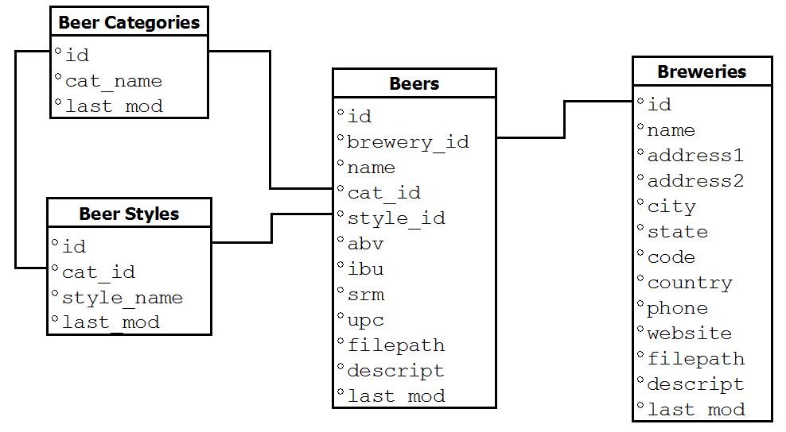
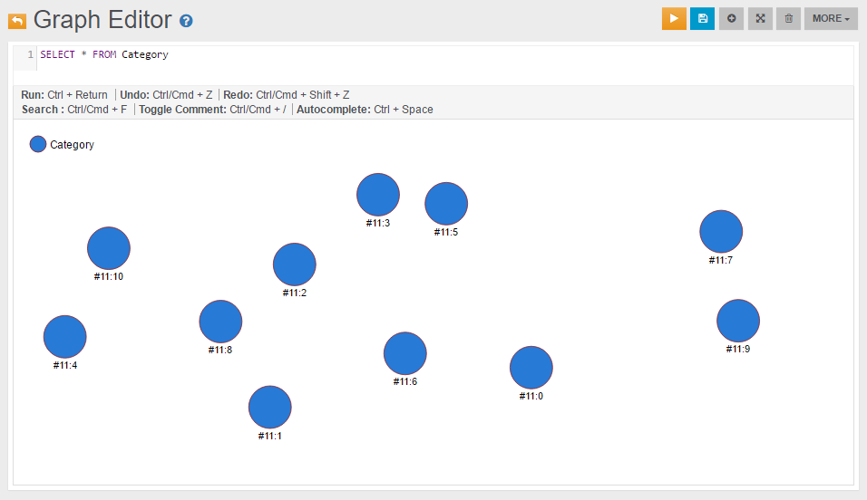
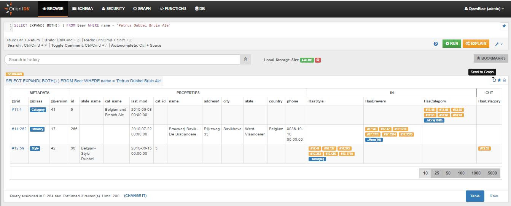
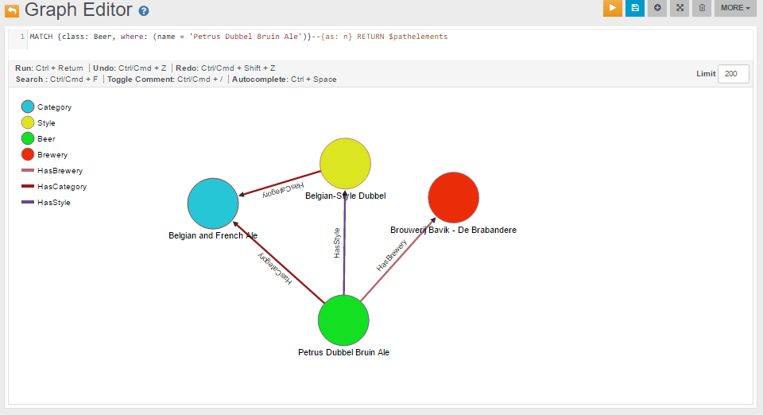
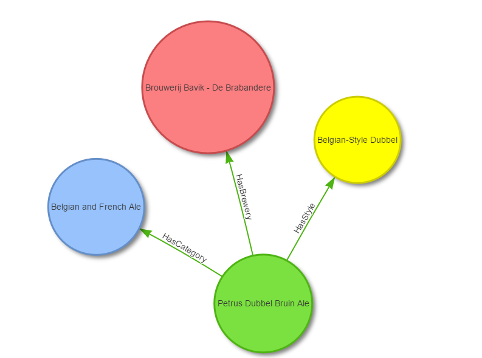
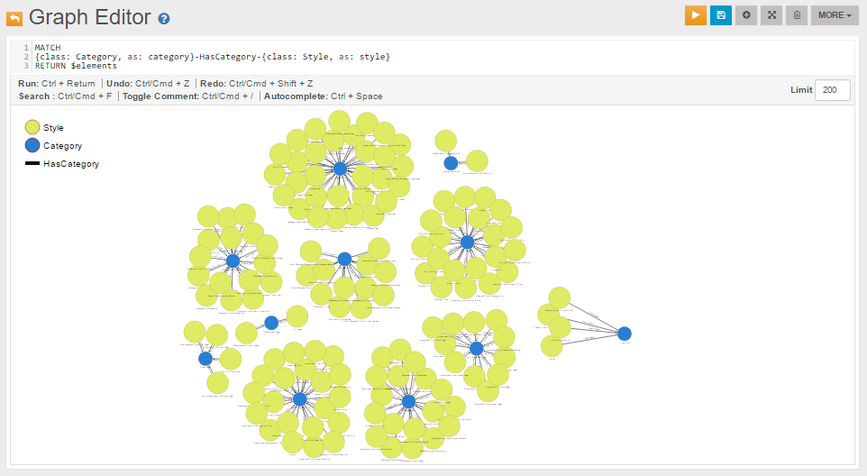

---
search:
   keywords: ['tutorial', 'etl', 'ETL', 'ETL example', 'database of beers','beer', 'visualization', 'match']
---

<!-- proofread 2015-12-11 SAM -->
# Tutorial: Importing the Open Beer Database into OrientDB


In this tutorial we will use the OrientDB's [ETL](ETL-Introduction.md) module to import, as a graph, the [Open Beer Database](https://openbeerdb.com/).

_Note_: You can access directly the converted database, result of this ETL tutorial, in the following ways:

- **Studio**: in the login page press the "Cloud" button, put server's credential and press the download button from the "OpenBeer" row;

- **Direct Download**: download the database from http://orientdb.com/public-databases/OpenBeer.zip and unzip it in a OpenBeer folder inside OrientDB's server "databases" directory.


## The Open Beer Database

The Open Beer Database can be downloaded in CSV format from [https://openbeerdb.com/](https://openbeerdb.com/). The following image shows its _relational_ model:




## Preliminary Steps

First, please create a new folder somewhere in your hard drive, and move into it. For this test we will assume `/temp/openbeer`:

```
$ mkdir /temp/openbeer
$ cd /temp/openbeer
```


### Download the Open Beer Database in CSV format

Download the Open Beer Database in CSV format and extract the archive:

```
$ curl http://openbeerdb.com/files/openbeerdb_csv.zip > openbeerdb_csv.zip
$ unzip openbeerdb_csv.zip
```

The archive consists of the following files:

- `beers.csv:` contains the beer records
- `breweries.csv:` contains the breweries records
- `breweries_geocode.csv`: contains the geocodes of the breweries. This file is not used in this Tutorial
- `categories.csv`: contains the beer categories
- `styles.csv`: contains the beer styles


### Install OrientDB

Download and install OrientDB:

<pre><code class="lang-sh">$ wget {{book.CE_link}} -O {{book.CE_name}}-{{book.lastGA}}.tar.gz
$ tar xvf {{book.CE_name}}-{{book.lastGA}}.tar.gz</code></pre>

For more information on how to install OrientDB, please refer to the [Installation](Tutorial-Installation.md) section.


### Graph Data Model

Before starting the ETL process it's important to understand how the Open Beer Database can be modeled as a graph. 

The relational model of the Open Beer Database can be easily converted to a _graph_ model, as shown below:


The model above consists of the following nodes (or vertices) and relationships (or edges):

- **Nodes**: Beer, Category, Style, Brewery;
- **Relationships**: HasCategory, HasStyle, HasBrewery.

For more informations on the Graph Model in OrientDB, please refer to the [Graph Model](Tutorial-Document-and-graph-model.md#the-graph-model) section.


## ETL Process

The ETL module for OrientDB provides support for moving data to and from OrientDB databases using Extract, Transform and Load processes.

The ETL module consists of a script, `oetl.sh`, that takes in input a single JSON configuration file.

For more information on the ETL module, please refer to the [ETL](etl/ETL-Introduction.md) section.


### Import Beer Categories

The following are the first two lines of the `categories.csv` file:

```
"id","cat_name","last_mod"
"1","British Ale","2010-10-24 13:50:10"
```

In order to import this file in OrientDB, we have to create the following file as `categories.json`:

```json
{
  "source": { "file": { "path": "/temp/openbeer/openbeerdb_csv/categories.csv" } },
  "extractor": { "csv": {} },
  "transformers": [
    { "vertex": { "class": "Category" } }
  ],
  "loader": {
    "orientdb": {
       "dbURL": "plocal:../databases/openbeerdb",
       "dbType": "graph",
       "classes": [
         {"name": "Category", "extends": "V"}
       ], "indexes": [
         {"class":"Category", "fields":["id:integer"], "type":"UNIQUE" }
       ]
    }
  }
}
```

To import it into OrientDB, please move into the "bin" directory of the OrientDB distribution:

```
$ cd orientdb-community-2.2.8/bin
```

and run OrientDB ETL:

```
$ ./oetl.sh /temp/openbeer/categories.json

OrientDB etl v.2.0.9 (build @BUILD@) www.orientechnologies.com
BEGIN ETL PROCESSOR
END ETL PROCESSOR
+ extracted 12 rows (0 rows/sec) - 12 rows -> loaded 11 vertices (0 vertices/sec) Total time: 77ms [0 warnings, 0 errors]
```


### Import Beer Styles
Now let's import the Beer Styles. These are the first two lines of the `styles.csv` file:

```
"id","cat_id","style_name","last_mod"
"1","1","Classic English-Style Pale Ale","2010-10-24 13:53:31"
```
 
In this case we will correlate the Style with the Category created earlier.

This is the `styles.json` to use with OrientDB ETL for the next step:

```json
{
  "source": { "file": { "path": "/temp/openbeer/openbeerdb_csv/styles.csv" } },
  "extractor": { "csv": {} },
  "transformers": [
    { "vertex": { "class": "Style" } },
    { "edge": { "class": "HasCategory",  "joinFieldName": "cat_id", "lookup": "Category.id" } }
  ],
  "loader": {
    "orientdb": {
       "dbURL": "plocal:../databases/openbeerdb",
       "dbType": "graph",
       "classes": [
         {"name": "Style", "extends": "V"},
         {"name": "HasCategory", "extends": "E"}
       ], "indexes": [
         {"class":"Style", "fields":["id:integer"], "type":"UNIQUE" }
       ]
    }
  }
}
```

Now, to import the styles, please execute the following command:

```
$ ./oetl.sh /temp/openbeer/styles.json

OrientDB etl v.2.0.9 (build @BUILD@) www.orientechnologies.com
BEGIN ETL PROCESSOR
END ETL PROCESSOR
+ extracted 142 rows (0 rows/sec) - 142 rows -> loaded 141 vertices (0 vertices/sec) Total time: 498ms [0 warnings, 0 errors]
```


### Import Breweries
Now it's time for the Breweries. These are the first two lines of the `breweries.csv` file:

```
"id","name","address1","address2","city","state","code","country","phone","website","filepath","descript","last_mod"
"1","(512) Brewing Company","407 Radam, F200",,"Austin","Texas","78745","United States","512.707.2337","http://512brewing.com/",,"(512) Brewing Company is a microbrewery located in the heart of Austin that brews for the community using as many local, domestic and organic ingredients as possible.","2010-07-22 20:00:20"
```

Breweries have no outgoing relations with other entities, so this is a plain import similar to the one we did for the categories. 

This is the `breweries.json` to use with OrientDB ETL for the next step:

```json
{
  "source": { "file": { "path": "/temp/openbeer/openbeerdb_csv/breweries.csv" } },
  "extractor": { "csv": {} },
  "transformers": [
    { "vertex": { "class": "Brewery" } }
  ],
  "loader": {
    "orientdb": {
       "dbURL": "plocal:../databases/openbeerdb",
       "dbType": "graph",
       "classes": [
         {"name": "Brewery", "extends": "V"}
       ], "indexes": [
         {"class":"Brewery", "fields":["id:integer"], "type":"UNIQUE" }
       ]
    }
  }
}
```

Run the import for breweries:

```
$ ./oetl.sh /temp/openbeer/breweries.json

OrientDB etl v.2.0.9 (build @BUILD@) www.orientechnologies.com
BEGIN ETL PROCESSOR
END ETL PROCESSOR
+ extracted 1.395 rows (0 rows/sec) - 1.395 rows -> loaded 1.394 vertices (0 vertices/sec) Total time: 830ms [0 warnings, 0 errors]
```

### Import Beers
Now it's time for the last and most important file: the Beers! These are the first two lines of the `beers.csv` file:

```
"id","brewery_id","name","cat_id","style_id","abv","ibu","srm","upc","filepath","descript","last_mod",,,,,,,,,,,,,,,,,,,,,,,,,,,,,,,,,,,,,,,,,,,,,,,,,,,,,,,,,,,,,,,,,,,,,,,,,,,,,,,,,,,,,,,,,,,,,,,,,,,,,,,,,,,,,,,,,,,,,,,,,,,,,,,,,,,,,,,,,,,,,,,,,,,,,,,,,,,,,,,,,,,,,,,,,,,,,,,,,,,,,,,,,,,,,,,,,,,,,,,,,,,,,,,,,,,,,,,,,,,,,,,,,,,,,,,,,,,,,,,,,,,,,,,,,,,,,,,,,,,,,,,,,,,,,,,,,,,,,,,,,,,,,,,,,,,,,,,,,,,,,,,,,,,,,,,,,,,,,,,,,,,,,,,,,,,,,,,,,,,,,,,,,,,,,,,,,,,,,,,,,,,,,,,,,,,,,,,,,,,,,,,,,,,,,,,,,,,,,,,,,,,,,,,,,,,,,,,,,,,,,,,,,,,,,,,,,,,,,,,,,,,,,,,,,,,,,,,,,,,,,,,,,,,,,,,,,,,,,,,,,,,,,,,,,,,,,,,,,,,,,,,,,,,,,,,,,,,,,,,,,,,,,,,,,,,,,
"1","812","Hocus Pocus","11","116","4.5","0","0","0",,"Our take on a classic summer ale.  A toast to weeds, rays, and summer haze.  A light, crisp ale for mowing lawns, hitting lazy fly balls, and communing with nature, Hocus Pocus is offered up as a summer sacrifice to clodless days.
```

As you can see each beer is connected to other entities through the following fields:
- `brewery_id` -> **Brewery**
- `cat_id` -> **Category**
- `style_id` -> **Style**

This is the `beers.json` to use with OrientDB ETL for the next step:

```json
{
  "config" : { "haltOnError": false },
  "source": { "file": { "path": "/temp/openbeer/openbeerdb_csv/beers.csv" } },
  "extractor": { "csv": { "columns": ["id","brewery_id","name","cat_id","style_id","abv","ibu","srm","upc","filepath","descript","last_mod"],
                                "columnsOnFirstLine": true } },
  "transformers": [
    { "vertex": { "class": "Beer" } },
    { "edge": { "class": "HasCategory",  "joinFieldName": "cat_id", "lookup": "Category.id" } },
    { "edge": { "class": "HasBrewery",  "joinFieldName": "brewery_id", "lookup": "Brewery.id" } },
    { "edge": { "class": "HasStyle",  "joinFieldName": "style_id", "lookup": "Style.id" } }
  ],
  "loader": {
    "orientdb": {
       "dbURL": "plocal:../databases/openbeerdb",
       "dbType": "graph",
       "classes": [
         {"name": "Beer", "extends": "V"},
         {"name": "HasCategory", "extends": "E"},
         {"name": "HasStyle", "extends": "E"},
         {"name": "HasBrewery", "extends": "E"}
       ], "indexes": [
         {"class":"Beer", "fields":["id:integer"], "type":"UNIQUE" }
       ]
    }
  }
}
```

Run the final import for beers:

```
$ ./oetl.sh /temp/openbeer/beers.json

OrientDB etl v.2.0.9 (build @BUILD@) www.orientechnologies.com
BEGIN ETL PROCESSOR
...
+ extracted 5.862 rows (1.041 rows/sec) - 5.862 rows -> loaded 4.332 vertices (929 vertices/sec) Total time: 10801ms [0 warnings, 27 errors]
END ETL PROCESSOR
```

_Note_: the 27 errors are due to the 27 wrong content lines that have no id.


## Some Queries and Visualizations

Now that the database has been imported we can execute some queries and create some visualizations.

The following are some ways we can use to access the newly imported `OpenBeer` database:

- [Console](console/README.md)
- [Gremlin Console](Gremlin.md)
- [Studio](studio/README.md)
- [APIs & Drivers](Programming-Language-Bindings.md)
- some external tools, like [Gephy](Gephi.md)
- some external visualization libraries for graph rendering

If we want to query all *Category* vertices we can execute the following query:

```
SELECT * FROM Category
```

The following is the visualization we can create using the Studio's [Graph Editor](studio/Graph-Editor.md):



If we want to find all nodes directly connected to a specific beer (e.g. the beer *Petrus Dubbel Bruin Ale*) with either an incoming or outgoing relationship, we can use a query like the following:

```
SELECT EXPAND( BOTH() ) FROM Beer WHERE name = 'Petrus Dubbel Bruin Ale'
```

Alternatively, we can use the [MATCH](sql/SQL-Match.md) syntax:

```
MATCH {class: Beer, where: (name = 'Petrus Dubbel Bruin Ale')}--{as: n} RETURN $pathelements
```

If we execute the first query in the [Browse](studio/Query.md) tab of Studio we get the following result, from where we can see that there are three nodes connected to this beer, having *@rid* *11:4*, *14:262* and *12:59*:



We can send the result of this `SELECT` query to the [Graph Editor](studio/Graph-Editor.md) by clicking the icon "_Send to Graph_", or create a new visualization directly from the _Graph Editor_. 

The following is the visualization of the `MATCH` query above, executed directly on the _Graph Editor_:



The same resultset can be visualized using an external graph library. For instance, the following graph has been obtained using the library [vis.js](http://visjs.org) where the input *visjs* dataset has been created with a java program created using the OrientDB's Java [Graph API](java/Graph-Database-Tinkerpop.md):



We can also query bigger portions of the graph. For example, to query all beer *Category* nodes and for each of them all the connected *Style* nodes, we can use a [MATCH](sql/SQL-Match.md) query like the following:

```
MATCH 
{class: Category, as: category}-HasCategory-{class: Style, as: style}
RETURN $elements
```

The following is the visualization of the `MATCH` query above in the [Graph Editor](studio/Graph-Editor.md):



while the following is a visualization created for the same recordset using the library [vis.js](http://visjs.org):


