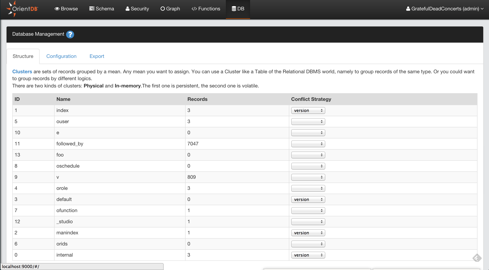

---
search:
   keywords: ['Studio', 'database', 'Database Management']
---

# Database Management
This is the panel containing all the information about the current database.

#Structure
Represents the database structure as clusters. Each cluster has the following information:
- `ID`, is the cluster ID
- `Name`, is the name of the cluster
- `Records`, are the total number of records stored in the cluster
- `Conflict Strategy`, is the conflict strategy used. I empty, the database's strategy is used as default

##Configuration

Contains the database configuration and custom properties. Here you can display and change the following settings:
- `dateFormat`, is the [date format](../Managing-Dates.md) used in the database by default. Example: yyyy-MM-dd
- `dateTimeFormat` is the [datetime format](../Managing-Dates.md) used in the database by default. Example: yyyy-MM-dd HH:mm:ss
- `localeCountry`, is the country used. "NO" means no country set
- `localeLanguage`, is the language used. "no" means no language set
- `charSet`,	is the charset used. Default is *UTF-8*
- `timezone`, is the timezone used. Timezone is taken on database creation
- `definitionVersion`, is the internal version used to store the metadata	
- `clusterSelection`, is the strategy used on selecting the cluster on creation of new record of a class
- `minimumClusters`, minimum number of clusters to create whenat class creation
- `conflictStrategy`, is the database strategy for resolving conflicts

##Export
Allows to export the current database in GZipped JSON format. To import the file into another database, use the [Import Console Command](../Console-Command-Import.md).

