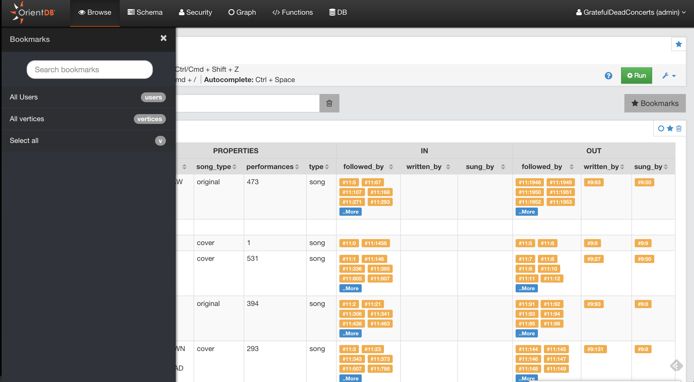

# _Browse_ Panel

Studio supports auto recognition of the language you're using between those supported: [SQL](/sql/README.md) and [Gremlin](/gremlin/Gremlin.md). 
While writing, use the auto-complete feature by pressing Ctrl + Space.

Other shortcuts are available in the query editor:

* **Ctrl + Return** to execute the query or just click the **Run** button
* **Ctrl/Cmd + Z** to undo changes
* **Ctrl/Cmd + Shift** + Z  to redo changes
* **Ctrl/Cmd + F** to search in the editor
* **Ctrl/Cmd + /** to toggle a comment

> **Note:**
> If you have multiple queries in the editor, you can select a single query with text selection and execute it with **Ctrl + Return** or the **Run** button

By clicking any @rid value in the result set, you will go into [document edit](Studio-Edit-Document.md) mode if the record is a Document, otherwise you will go into [vertex edit](Studio-Edit-Vertex.md).

You can bookmark your queries by clicking the star icon in the results set or in the editor.
To browse bookmarked queries, click the **Bookmarks** button. _Studio_ will open the bookmarks list on the left, where you can edit/delete or rerun queries.

_Studio_ saves the executed queries in the Local Storage of the browser, in the query settings, you can configure how many queries _Studio_ will keep in history. 
You can also search a previously executed query, delete all the queries from the history or delete a single query.

Starting from _Studio_ v.2.0, you can send the result set of a query to the [Graph Editor](/studio/working-with-data/graph-editor/README.md) by clicking on the circle icon in the result set actions. This allows you to visualize your data graphically.

## JSON Output

Studio communicates with the OrientDB Server using [HTTP/RESt+JSON protocol](/misc/OrientDB-REST.md). To see the output in JSON format, press the **RAW** tab.

## Query Explain
